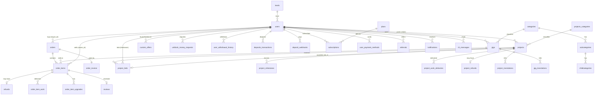

# Legacy data model
Source: 230 migrations in `legacy/APP/database/migrations`, Eloquent models `legacy/APP/app/Models`. No production schema dump was provided (Q-003). All tables use MySQL; FKs mostly `no action`. Money columns are mostly **strings** (varchar) — see risks.

## 0. Schema drift — things migrations cannot explain (Q-003, Q-040)
- `sliders` table used by `app/Models/Slider.php:17` — no migration.
- `categories.name` / `subcategories.name`: create migrations lack `name` for categories, yet `2023_09_10_172332_change_name_to_nullable_categories_subcategories_table.php:17-25` alters it ⇒ column exists in live DB only.
- `projects.title`, `projects.description`, `projects.duration` are NOT NULL in `2022_11_04_202305_create_projects_table.php:21-28` but project creation never sets them (`app/Livewire/Main/Post/ProjectComponent.php` (CR) 652-1000); translations go to `project_translations`. Live columns must be nullable/defaulted.
- `project_milestones.status='delivered'` written by `app/Livewire/Main/Seller/Projects/Options/DeliverComponent.php:198` but enum is `request,funded,paid,reject,refunded` (`2025_09_27_000001_...:15`). `ProjectMilestoneStatus::DRAFT` (`app/Enums/ProjectMilestoneStatus.php:10`) not in DB enum; `reject` in DB not in enum.
- `gigs.gig_id` selected in `app/Http/Controllers/Main/PaymentBogController.php:58` — column does not exist.
- `order_items.subtotal_value` read in `app/Livewire/Admin/Orders/OrdersComponent.php:101` — column does not exist.
- `level_translations.level_id` FK points to `categories` (`2023_10_16_122542_...:20`); `subcategory_translations.subcategory_id` FK points to `categories` (`2023_09_10_135741_...:22`). Bugs; live FKs unknown.
- `projects_categories.name` dropped (`2024_11_02_112440`), names now in `projects_categories_translation` (recreated `2024_10_29_183022`).
- `users.account_type` default changed to `seller` (`2025_06_08_213608_...:11-19`).
- Chatify migrations deleted at runtime by `app/Http/Controllers/Update/UpdateController.php`.
- Unused tables: `companies`, `jazzcash_transactions`, legacy `conversations/conversation_messages` (superseded by Chatify `ch_messages`).

## 1. Core tables (columns, enums, meaning)
### users (`2022_06_24_104501` + adds)
id, uid(20,uniq), username(60,uniq), email(60,uniq), email_verified_at, password(60, nullable for social), account_type enum(seller,buyer) default **seller** (since 2025-06), avatar_id→file_manager, level_id→levels, provider_name, provider_id, country_id→countries, city, timezone, fullname(60), headline(100), description, status enum(**active, pending, verified, banned**) default pending, is_restricted bool, restriction_id→user_restrictions, **balance_net, balance_withdrawn, balance_purchases, balance_pending, balance_available** (varchar 20, default 0), balance_points int (2025-10), referral_code(20,uniq), remember_token, active_status bool (Chatify online), dark_mode bool, last_activity, deleted_at (soft delete), timestamps.
Meaning of balances: available = withdrawable wallet; pending = escrow waiting for release (seller side) AND in some paths client's locked project funds (see features.md BR-M*); withdrawn = cumulative withdrawn (incl. pending requests); purchases = cumulative buyer spending on gigs; net = unused.
### admins — id, uid, username, email(uniq), password, remember_token. No roles.
### levels / level_translations — title, account_type enum(seller,buyer), seller_sales_min/max, buyer_purchases_min/max, level_color, level_bg_color, badge_id, order_number.
### categories (gigs) → subcategories → childcategories, each with *_translations (locale, name, content_top, content_bottom), icon_id/image_id, slug(uniq), is_visible.
### gigs — uid, user_id, title (nullable since 2024-03; real text in gig_translations), slug(160), description, price(varchar 10), delivery_time int (days: 0,1,2,3,4,5,6,7,14,21,30), category_id, subcategory_id, childcategory_id, image_thumb/medium/large_id, status enum(**pending, rejected, active, deleted, boosted, trending, featured**) — "active" scope = active|boosted|trending|featured (`app/Models/Gig.php:75-78`), rejection_reason, counter_visits/impressions/sales/reviews, rating(varchar 5), orders_in_queue, has_upgrades, has_faqs, video_link, video_id, soft deletes.
Children: gig_translations(locale,title,description), gig_faqs, gig_requirements(type enum text|choice|file, is_required, is_multiple) + gig_requirement_options, gig_upgrades(uid,title,price,extra_days), gig_seo, gig_images, gig_documents, gig_visits (geo/device analytics), reported_gigs(status pending|seen), favorites(user_id,gig_id; cascade).
### orders — uid (varchar, enlarged 2024-09; BOG orders use `b_`+32 chars), buyer_id, total_value, subtotal_value, taxes_value (varchar), is_finished, placed_at.
### order_items — uid, order_id, gig_id, owner_id(seller), quantity, has_upgrades, is_requirements_sent, order_details (longtext, 2025-10: buyer free-text requirements), total_value, profit_value (seller net), commission_value, status enum(**pending, proceeded, delivered, canceled, refunded**), is_finished (money released/closed), placed_at, expected_delivery_date, canceled_by enum(seller,buyer), proceeded_at, delivered_at, canceled_at, refunded_at.
Children: order_item_upgrades, order_item_requirements(form_type), order_item_work(attached_work, quick_response), order_item_work_conversation, order_invoice(payment_method, payment_id, names, email, company, address, status enum(**paid, pending**)).
### refunds (gig) — uid, item_id→order_items, seller_id, buyer_id, reason, status enum(**pending, rejected_by_seller, rejected_by_admin, accepted_by_seller, accepted_by_admin, closed**), is_seen_by_seller/admin, request_admin_intervention (= dispute), created_at. refund_conversation (morph author).
### projects — uid, pid(6 digits, random), user_id(client), slug, category_id→projects_categories, subcategory_id, childcategory_id, budget_min, budget_max (int), budget_type enum(fixed,hourly), duration, status enum(**pending_approval, pending_payment, active, completed, hidden, rejected, under_development, pending_final_review, incomplete, closed**), rejection_reason, is_featured/is_urgent/is_highlighted/is_alert + expiry_date_*, counters, expiry_date, awarded_bid_id→project_bids, awarded_freelancer_id→users. project_translations(locale,title,description). project_required_skills→projects_skills(+translations; category_id now → categories). project_shared_files, project_visits, reported_projects.
### project_bids — uid, project_id, user_id, amount(varchar), days, message, is_sponsored/is_sealed/is_highlight, is_awarded, is_freelancer_accepted, status enum(**pending_approval, pending_payment, active, rejected, hidden**), admin_rejection_reason, freelancer_rejection_reason (reason_1..reason_8), awarded_date, freelancer_accepted_date, freelancer_rejected_date. project_bid_upgrades (paid bid promotions; status pending|rejected|paid), project_reported_bids, projects_bidding_plans (sponsored|sealed|highlight).
### project_milestones — uid, project_id, created_by enum(employer,freelancer), freelancer_id, employer_id, amount decimal(12,2), employer_commission, freelancer_commission (decimal), description(160), status enum(**request, funded, paid, reject, refunded**), is_draft bool.
### project_work_deliveries (2025-07) — uid, project_id, milestone_id, freelancer_id, attached_work JSON, quick_response, status string (pending|proceeded|delivered|completed per `app/Enums/ProjectWorkDeliveryStatus.php`), delivered_at. project_work_conversations.
### project_refunds (2025-08) — uid, project_id, freelancer_id, client_id, reason, status string (same values as ProjectRefundStatus enum), is_seen_*, request_admin_intervention. project_refund_conversations.
### unblock_money_requests (2025-08) — uid, freelancer_id, requestable (morph: OrderItem|Project), amount decimal(10,2), reason, status string(pending|approved|rejected|closed), flags; unique(freelancer, requestable, status).
### custom_offers — uid, freelancer_id, buyer_id, message, budget_amount, budget_buyer_fee, budget_freelancer_fee, delivery_time, freelancer_status enum(**pending, rejected, approved, completed, canceled**), admin_status enum(**pending, rejected, approved**), rejection reasons, payment_status enum(**pending, funded, released**), expires_at, delivered_at, canceled_at. custom_offer_attachments, custom_offer_work.
### Money-in/out tables
- deposits_transactions — user_id, transaction_id(uniq), payment_method, amount_total/fee/net, currency, exchange_rate, status enum(paid,pending,rejected), reject_reason, ip.
- deposit_webhooks — payment_id(uniq), order_id (BOG order id, 2025-06), payment_method, user_id, amount, status enum(succeeded,failed,pending). Also used for subscriptions.
- checkout_webhooks — data (buyer_id + cart JSON), payment_id, payment_method, status.
- user_withdrawal_history — uid, user_id, gateway_provider_name (paypal|offline), gateway_provider_id (text: email or bank details), amount (net), fee, status enum(pending,paid,rejected).
- user_withdrawal_settings — per-user payout method.
- user_payment_methods (2025-07) — saved BOG card metadata: card_type, masked_card_number, expiration_month/year, card_holder_name, is_default.
- project_subscriptions — paid project promotions (total, payment_method, status pending|paid, receipt).
- plans (laravelcm) — name JSON, slug, description JSON, invoice_period/interval, features_included/excluded JSON, price, yearly_price, signup_fee, currency, sort_order. Seeded: `standard` 0 GEL, `premium` 9.99 GEL/month, 99.99/year (`database/seeders/SubscriptionPlanSeeder.php:16-105`).
- subscriptions — morph subscriber, plan_id, name JSON, slug(uniq), description JSON, payment_id (FK to deposit_webhooks.id for paid; NULL = gifted/points), billing_period (month|year), starts_at, ends_at, cancels_at, canceled_at, soft deletes.
- referrals (referrer_id, referred_user_id, referral_code, status pending|verified|cancelled), referral_earnings (event_type signup, points, status pending|approved|cancelled), referral_code_benefits (code, premium_duration_months, is_active).
### Other
notifications (in-app: uid, user_id, action URL, text = translation key, params JSON text, is_seen); ch_messages / ch_favorites (Chatify: bigint id app-generated, type, from_id, to_id, body, attachment JSON, is_audio, seen); conversations/conversation_messages (legacy chat); reviews (user_id, seller_id, gig_id, order_item_id, rating 1-5, message, status active|hidden); verification_center (document_type id|driver_license|passport, front/back/selfie file ids, status pending|verified|declined); user_restrictions (status pending|approved|rejected|submitted, files_required) + appeals + files; banned_ips (attempts ≥3 = banned); user_skills (experience beginner|intermediate|pro), user_languages (level basic|conversational|fluent|native), user_availability (expected_available_date), user_linked_accounts, user_billing, user_portfolio (status pending|active) + gallery; reported_users; support_messages; newsletter_list/verifications/settings; pages + page_translations (column enum 1-4); blog_articles/+seo/+comments/+translations, blog_settings; advertisements; countries; languages (language_code, country_code, force_rtl, timing locales, params); file_manager (uid, file_name, file_url, folder, size, mimetype, extension, storage_driver, morph uploader); media (spatie); logo_cloud; packages + translations; attributes + options + translations; tracker_* (geoip, agents, devices, languages, domains, referers, referer_search_terms, sessions) = custom analytics; sessions; jobs; failed_jobs; password_resets(expires_at); email_verifications; personal_access_tokens.
### Settings singletons (row id 1, cached forever via `settings()` helper, `app/Utils/Helper/helpers.php:261+`)
settings_general (title, logos, default_language, enable_multivendor, freelancer_requires_approval), settings_currency (name, code, exchange_rate), settings_commission (enable_taxes, tax_type fixed|percentage, tax_value, commission_from orders|withdrawals|both, commission_type, commission_value), settings_publish (auto_approve_gigs/portfolio, limits, custom offer settings: enable, require approval, commission type/values freelancer & buyer, expiry days, attachments), settings_media, settings_withdrawal (min_withdrawal_amount, withdrawal_period daily|weekly|monthly), settings_auth (verification_required, verification_type admin|email, expiry periods, social toggles, default levels, auth image), settings_footer, settings_security (is_recaptcha, is_social_media_accounts), settings_seo (is_sitemap...), settings_appearance (colors, sizes, dark mode, custom code head/footer per layout), settings_hero, live_chat_settings, projects_settings (is_enabled, auto_approve_projects/bids, is_free_posting, is_premium_posting/bidding, commission_type, commission_from_freelancer, commission_from_publisher, who_can_post buyer|seller|both, max_skills), projects_plans (featured|highlight|urgent|alert, price, days), blog_settings, newsletter_settings, offline_payment_settings, automatic_payment_gateways (slug, currency, exchange_rate, fixed_fee JSON, percentage_fee JSON, deposit_min/max, settings JSON with credentials, is_active, country), offline_payment_gateways, ~18 legacy `<gateway>_settings` tables.
Seeded defaults (production values unknown, Q-002): commission 10% from orders, tax 2% percentage enabled (`database/seeders/SettingsCommissionTableSeeder.php`); projects commission 2.3% freelancer / 2.2% publisher, projects disabled by default (`ProjectsSettingsTableSeeder.php`); min withdrawal 10, daily (`SettingsWithdrawalTableSeeder.php`); BOG gateway GEL, percentage_fee gigs 2.5 (`BogSeeder.php`).

## 2. ER diagram (core)

