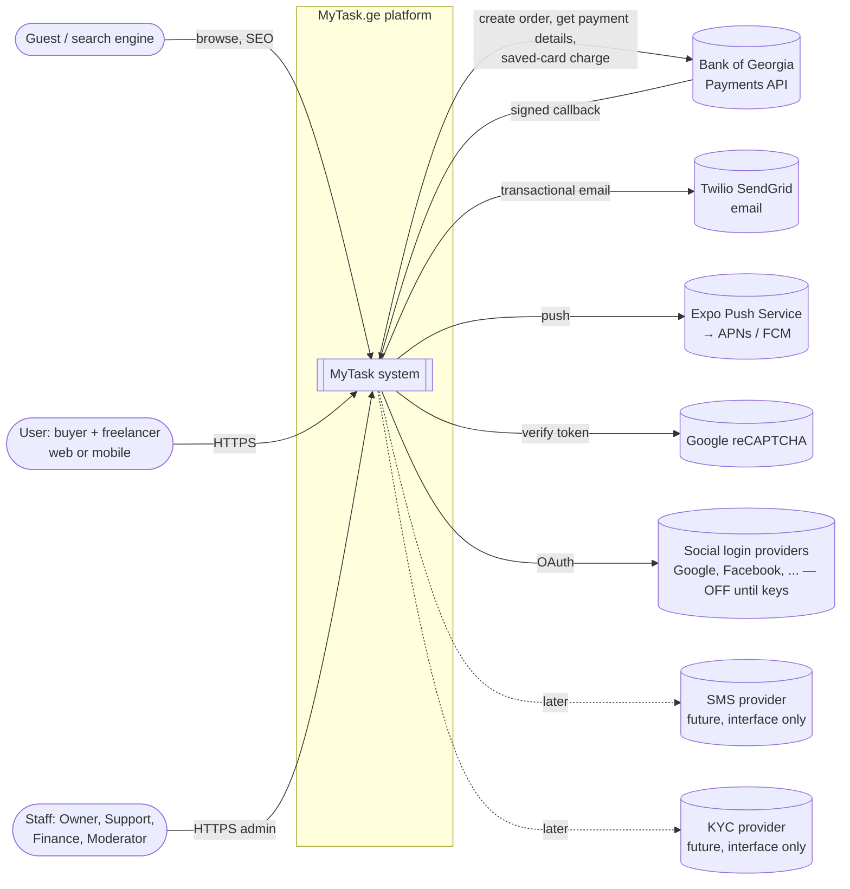
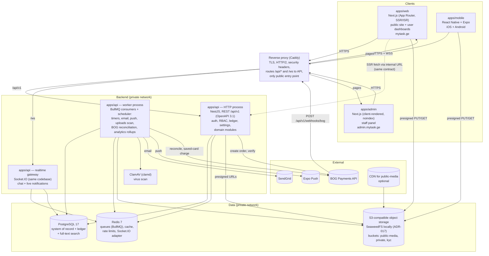
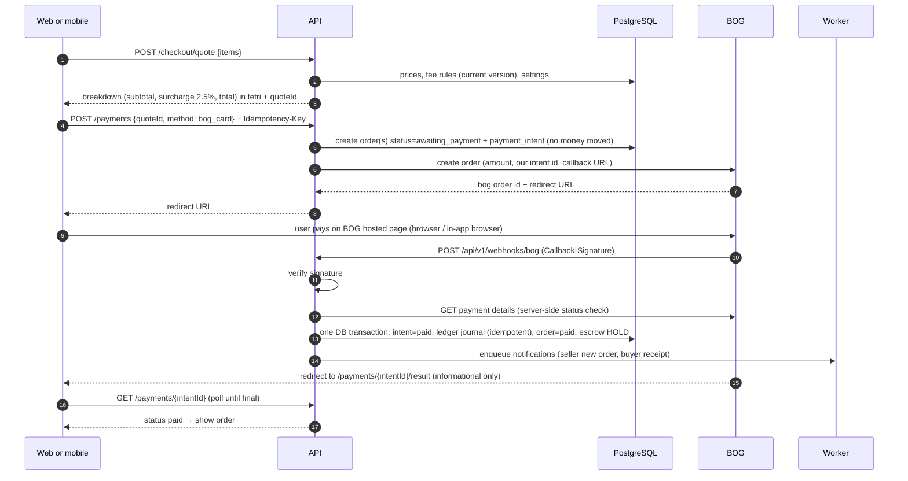
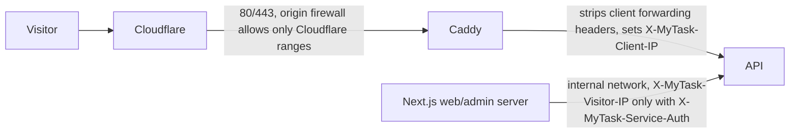

# Architecture — MyTask.ge rebuild
Status: **accepted (Owner 2026-09-30)** | Author: solution-architect (P2-B1) | Date: 2026-09-28

> **Revised 2026-09-30 (Owner Phase 2 gate).** The Owner approved this document, ADR-001…016, the data model, the URL map and the API contract (`docs/04-api/openapi.yaml` 1.0.0). Gate answers applied: §7.1 slow-mode slot bypass (SEC-30), emailed codes for accounts without a password and the 24-hour withdrawal pause after security changes (Q-144, S-129); §7.2 extended staff step-up list (Q-145) and withdrawals list/detail under `withdrawals.approve` (Q-113); §7.12 S-127 fixed-code vendors only (Q-146); §7.15 BOG callback storage caps (SEC-31), negative legacy holds write-off only (Q-120). From now on, changes to the contract, the data model or an ADR need a new ADR and a handoff (CLAUDE.md).

> **Revised 2026-09-28** (P2-B2/B3 step) to match the Owner answers Q-081, Q-082, Q-084, Q-085, Q-086, Q-087 and the adjusted P-4, together with the revised ADR-002, ADR-004, ADR-008, ADR-013 and ADR-016. Changed: §7.1 (2FA trigger S-124, staff 2FA S-060), §7.4 (final account list in data-model.md), §7.6 (fresh 72h when auto-release is switched back ON), §7.12 (S-110), §7.15 (standard BOG structure; Premium by card in the apps) and the ADR index.
> **Revised 2026-09-30** after the P2-B5 security review (`docs/06-qa/security/00-blueprint-2026-09-30.md`), with ADR-002, 004, 009, 010, 012, 013 and 015. Changed: §7.1 (prefixed host-only cookies, exact-origin CSRF for every unsafe cookie-capable request, deny-list on every revocation, per-account login/2FA/re-auth throttles, client-bound social login), §7.11 (read-only Bull Board), §7.12 (S-110 trust boundary and kill switch), §7.14 and new §7.16 (client IP chain, ADR-013 §14–§19).

Inputs: `docs/00-vision.md`, `docs/01-discovery/*`, Owner answers Q-002…Q-080 in `docs/01-discovery/open-questions.md` (authoritative), approved `docs/02-specs/00-platform-rules.md` (S-001…S-122, P-1…P-13), `docs/05-design/audit.md`.
Decisions are recorded one per ADR in `docs/03-architecture/adr/` (ADR-001…ADR-016). This document ties them together. If this document and an ADR disagree, the ADR wins and this document gets fixed.

Not in this document: the database schema and legacy mapping (`data-model.md`, P2-B2, written), URL mapping (`url-map.md`, P2-B3, written), the endpoint contract (`docs/04-api/openapi.yaml`, P2-B4, later).

---

## 1. The one rule that makes a mobile app possible

**All business logic lives in `apps/api`. The web app, the admin app and the mobile app contain no business rules. They only call the API described in `docs/04-api/openapi.yaml`.**

The old platform cannot have an app because every rule sits inside a web page (304 Livewire components that read and write the database directly, `docs/01-discovery/inventory.md` §3). In the new system that is made structurally impossible:

| Mechanism | What it prevents |
|---|---|
| Clients have **no database credentials and no ORM**. Only `apps/api` (and its worker process) can reach PostgreSQL, Redis and the private storage buckets. The network in `docker compose` and in production puts the database on an internal network that clients are not attached to. | A page reading or writing data directly |
| Clients import only generated code from the contract: `packages/types` (types) and `packages/api-client` (typed fetch client), both generated from `openapi.yaml` (ADR-014). A lint rule (`eslint-plugin-boundaries` / `no-restricted-imports`) forbids `apps/web`, `apps/admin` and `apps/mobile` from importing `apps/api` code or `@prisma/client`. | Logic copied into a client |
| Anything the user sees that is **computed** comes from the API: checkout totals and the card surcharge (`POST /checkout/quote`), withdrawal fee and payout amount, plan limits, "can I do this?" flags (`permissions`/`actions` fields on resources, e.g. `canRequestRevision`, `canSendProposal`), the auto-release deadline, masked usernames (BR-015). Clients render them; they never recompute them. | Web and app showing different numbers, or a client bypassing a rule |
| Every permission and ownership check runs in the API (guards + policies, ADR-010). Hiding a button in a client is cosmetic only. | R-018, R-019-style bugs (UI-only gates) |
| Clients may do **form-level UX validation only** (required, length, pattern) and only from the constraints that are in the OpenAPI schemas (generated). The API validates again and is authoritative. | Rules drifting between web and mobile |
| The contract is tested: the API validates its own requests and responses against `openapi.yaml` in the test suite; CI fails on drift (ADR-014). | The API and the clients disagreeing silently |

Consequence: a new client (for example an AI assistant or a partner integration later) needs nothing but the contract.

---

## 2. System context



Removed external integrations (never called by the new system): Pusher (replaced, ADR-007), findip.net and ip-api.com (Q-055, ADR-012), Binance (Q-041), the 28 foreign gateways (Q-016), Envato licensing.

---

## 3. Containers



| Container | Technology (ADR) | Responsibility | Never does |
|---|---|---|---|
| `apps/api` HTTP | NestJS 11, TypeScript strict, Prisma + raw SQL for ledger locking (ADR-001) | Every business rule, auth, RBAC, validation, ledger postings, settings, payments, search, file permission checks | Serve static files, run shell commands, expose maintenance endpoints |
| `apps/api` realtime | Socket.IO gateway in the same NestJS codebase, Redis adapter (ADR-007) | Push chat messages, typing/read receipts, live notification badge to connected web/mobile clients | Accept writes that bypass REST (messages are written via REST first) |
| `apps/api` worker | Same codebase, separate entry point `worker.ts`, BullMQ (ADR-008) | Timers (auto-release, award expiry, refund auto-reject, offer expiry, renewals + reminders), email/push sending, upload scanning, BOG reconciliation, analytics rollups, backups trigger | Serve HTTP (except an internal health port) |
| `apps/web` | Next.js (App Router), React Server Components, `output: standalone` (ADR-001) | Public SEO pages (SSR/ISR), user dashboards, `/en/` routing (ADR-006), sitemap route handlers | Contain rules, talk to the DB, hold secrets other than its own public config |
| `apps/admin` | Next.js, client-rendered, separate origin `admin.mytask.ge`, `noindex` (ADR-010) | Staff panel: moderation, users, money operations, settings register, Commission & Fee module, translations, analytics, logs | Same as web; it is just another API client with a staff token |
| `apps/mobile` | React Native + Expo (Expo Router, EAS Build) (ADR-001) | iOS + Android app with the same flows as the web dashboards and public browsing | Same as web |
| PostgreSQL | PostgreSQL 17 (ADR-001, ADR-003, ADR-011) | System of record, double-entry ledger, settings versions, full-text search (`pg_trgm`), later `pgvector` for AI | – |
| Redis | Redis 7 (Valkey-compatible) | Queues, cache (settings, sessions deny-list), rate limits, Socket.IO fan-out | Be a system of record (everything in Redis can be rebuilt) |
| Object storage | S3 API; SeaweedFS locally (ADR-009, ADR-017) | Files: public media, private deliveries/attachments, KYC | Be publicly listable; private objects are only reachable through short-lived signed URLs |
| Reverse proxy | Caddy 2 (ADR-013) | TLS (automatic certificates), routing, security headers, request size limits; the **only** container with public ports | Serve any directory from the repository |

---

## 4. Monorepo layout (ADR-001)

pnpm workspaces + Turborepo. TypeScript `strict: true` everywhere (CLAUDE.md).

```
mytask-rebuild/
├── apps/
│   ├── api/                  NestJS: src/main.ts (HTTP + WS), src/worker.ts (jobs)
│   │   ├── src/modules/      one module per domain: auth, users, profiles, catalog (categories/skills),
│   │   │                     gigs, orders, projects, proposals, offers, escrow, ledger, payments (bog),
│   │   │                     wallet, withdrawals, subscriptions, points, promo, reviews, chat,
│   │   │                     notifications, files, search, settings, fees, admin (staff, rbac, audit),
│   │   │                     moderation, content (pages, blog, newsletter), seo, analytics, i18n
│   │   ├── src/platform/     cross-cutting: config (env validation), db, redis, queue, storage,
│   │   │                     mail, push, sms (interface), logging, idempotency, errors, openapi validator
│   │   ├── prisma/           schema.prisma + migrations (data-model.md is the design source)
│   │   └── test/             unit, integration (real Postgres/Redis in docker), contract tests
│   ├── web/                  Next.js public site + user dashboards
│   ├── admin/                Next.js staff panel
│   └── mobile/               Expo app (Expo Router)
├── packages/
│   ├── types/                GENERATED from docs/04-api/openapi.yaml (openapi-typescript). Never hand-edited.
│   ├── api-client/           GENERATED typed client (openapi-fetch) + small hand-written wrapper for
│   │                         auth refresh, Accept-Language and Idempotency-Key headers (no business logic)
│   ├── tokens/               design tokens (tokens.json → CSS variables + RN theme object), P2-C2
│   ├── ui/                   design-system components: `@mytask/ui/web` and `@mytask/ui/native`
│   │                         entry points sharing props, variants and tokens (ADR-001 §UI)
│   ├── i18n/                 ka.json, en.json (UI strings, keys t_*), shared by web, admin, mobile
│   ├── assets/               logos, icons, category images, fonts (FiraGO woff2/ttf) + SOURCES.md
│   └── config/               shared tsconfig, eslint (incl. import-boundary rules), prettier
├── tools/
│   ├── migrate-legacy/       Phase 5 ETL: legacy MySQL → new PostgreSQL (mapping in data-model.md)
│   └── bog-mock/             local fake BOG (create order, hosted page, signed callback) for dev/tests
├── docker-compose.yml        local stack (§6)
├── .env.example              variable NAMES only (CLAUDE.md rule 8)
└── docs/
```

Dependency direction: `apps/* → packages/*`; `packages/*` never import `apps/*`; `apps/web|admin|mobile` never import `apps/api`. `packages/ui` depends only on `packages/tokens` and React / React Native. Business logic has exactly one home: `apps/api/src/modules`.

---

## 5. How web, mobile and API talk

### 5.1 Addresses
| Client | Base URL for the API | Why |
|---|---|---|
| Web (browser) | `https://mytask.ge/api/v1` (same origin, proxied by Caddy) | First-party cookies, no CORS at all (fixes R-022 `Access-Control-Allow-Origin: *`) |
| Web (Next.js server, SSR) | `http://api:3000/api/v1` (internal network) | Fast; forwards the user's access token as `Authorization: Bearer` |
| Admin (browser) | `https://admin.mytask.ge/api/v1` (same origin, proxied to the same API) | Staff cookies are host-only on the admin origin, separate from user cookies |
| Mobile | `https://mytask.ge/api/v1` + `wss://mytask.ge/ws` | Bearer tokens; no cookies |

All clients send `Accept-Language: ka|en` (default `ka`), and money endpoints get an `Idempotency-Key` header (ADR-003).

### 5.2 Conventions (enforced in `openapi.yaml`, P2-B4)
- Resource-based REST under `/api/v1`. Breaking changes only in a new version prefix; mobile apps in the stores must keep working for at least one release cycle (ADR-014).
- Errors: `{ "code": "PLAN_LIMIT_REACHED", "message": "<localized>", "details": {...} }`. `code` is stable and machine-readable (clients branch on it); `message` is localized by `Accept-Language`.
- Cursor pagination: `?cursor=&limit=` → `{ data: [...], nextCursor: string|null }`.
- Dates: ISO 8601 UTC (`2026-09-28T10:00:00Z`). Clients display in `Asia/Tbilisi` or the device zone.
- Money: `{ "amount": 999, "currency": "GEL" }`, amount = integer tetri (S-rule AC-17).
- Every endpoint has a permission note in the contract (role, ownership, staff permission name).

### 5.3 Typical request (checkout by card)

The return URL never changes state (fixes R-004). If the callback is lost, the worker's reconciliation job asks BOG for the status of every intent still pending after a few minutes (ADR-004).

---

## 6. Environments (CLAUDE.md rule 7: local first)

| Environment | When | What runs | Payments | Email |
|---|---|---|---|---|
| **local** | Phase 3 onward, on the Owner's computer | `docker compose up`: postgres, redis, s3 = SeaweedFS (+ bucket init, ADR-017), mailpit, clamav (profile `scan`, optional because it needs ~1.5 GB RAM), bog-mock. Apps run with `pnpm dev` (hot reload) or as compose services (`--profile apps`). Mobile: Expo Go / dev build pointing at the computer's LAN address | `tools/bog-mock` only. No real BOG credentials locally | Mailpit (http://localhost:8025), nothing leaves the computer |
| **staging** | Phase 5–6, only after Owner approval | Same compose file on a small VPS, separate database/buckets/keys, `noindex`, basic-auth in front of web and admin | BOG test environment if BOG provides one for the merchant; otherwise real 0.01 GEL tests only with explicit Owner approval (the legacy `staging` practice) | SendGrid sandbox mode or a restricted recipient allowlist |
| **production** | Phase 6, explicit Owner approval (CLAUDE.md) | Same containers; hosting proposal in ADR-015 (one VPS + managed/external object storage + off-site backups) | BOG live | SendGrid live |

Same container images in every environment; only `.env` differs. Configuration is validated at boot (zod schema); the process refuses to start if a required variable is missing (ADR-013).

---

## 7. Cross-cutting concerns

### 7.1 Authentication and sessions (ADR-002)
- One auth module issues tokens for all clients: **access token** = signed JWT (EdDSA/Ed25519), 15 minutes, audience `user` or `staff`; **refresh token** = opaque random 256-bit value, stored hashed in a `sessions` table, rotated on every use, with reuse detection (a reused refresh token revokes the whole session family).
- Web: tokens in host-only `HttpOnly; Secure; SameSite=Lax` cookies on `mytask.ge` named `__Host-mt_at`, `__Host-mt_did` and `__Secure-mt_rt` (refresh cookie path-scoped to `/api/v1/auth`). Every unsafe request that is not Bearer-authenticated, including login, register, 2FA, refresh, logout and the social callback, must carry a custom header (`X-MyTask-Client: web`) and an `Origin` **exactly equal** to the host's origin, and JSON bodies (CSRF defence, ADR-002 §2). The Next.js server reads the cookie and forwards it as a Bearer header for SSR.
- Mobile: tokens in `expo-secure-store` (Keychain / Keystore), sent as `Authorization: Bearer`.
- Staff: separate `staff` accounts (legacy `admins`), separate audience, host-only cookies on `admin.mytask.ge`, shorter refresh lifetime.
- **Legacy passwords (vision "must not break"):** legacy bcrypt `$2y$10$…` hashes are migrated unchanged with `algo = bcrypt_legacy`. At login the API verifies with bcrypt (the `$2y$` prefix is normalised to `$2b$`, which is the same algorithm), and on success re-hashes the password with Argon2id and stores it. Users never notice. Social-only users (null password) log in through their provider or set a password through reset.
- **One login pipeline** for password, social and 2FA: every path ends in the same `issueSession()` that checks status (banned / pending / trashed), restriction and IP ban (fixes R-020).
- Email 2FA (Q-043, Q-063, Q-072, S-056…S-060, S-124): after a correct password, if 2FA applies and the device is not trusted, the API returns `202 {challengeId}` and emails a 6-digit code (hashed in DB, 10 min, 5 attempts). A successful code marks the device (and its IP) trusted for 30 days. **When** a code is asked is the admin setting S-124 `auth.two_factor.trigger` (Q-082): `new_device` (default: new or expired device only) or `new_device_or_ip` (also on a new IP). Staff 2FA is the admin toggle S-060 (default ON, never hard-coded; P-4 as adjusted by the Owner) and uses the same trigger rule.
- Login throttling S-062/S-063 (per account + IP) and reCAPTCHA S-061 on web; mobile uses throttling plus the same reCAPTCHA-compatible challenge only when the risk score requires it (detail in spec 01). Added by P2-B5 (ADR-002 §5–§6): a per-account counter across all IPs with a slow mode instead of a hard lock (SEC-02), a per-account cap on wrong 2FA codes across challenges (SEC-03), and a per-account throttle on every in-session password or code check, including staff re-authentication (SEC-04). The IP used by every rule comes from §7.16. Slow mode cannot lock the owner out: attempts from a trusted device of the account, or with a passed reCAPTCHA on web, bypass the 30-second slot, and refused attempts never use it (SEC-30, spec 01 AC-53). Password reset stays outside every counter (SEC-32(b)).
- Accounts without a password confirm an email change, payout details and "log out other sessions" with a code emailed to the current address (Q-144). An email, password or payout-details change starts a **withdrawal pause** of S-129 hours (default 24) and raises a "details changed recently" flag for the approving staff member (spec 14 AC-21…AC-23).
- Logout revokes the session; "active sessions" (legacy `/account/sessions`) lists `sessions` rows and can revoke them; password change revokes all other sessions. Every revoked session id goes to a Redis deny-list, so it stops working at once (SEC-16).
- Social login is bound to the client that started it: a host-only binding cookie on web, an app-held PKCE verifier and a verified https App Link on mobile (ADR-002 §7, SEC-09); providers stay OFF until this is built.
- Staff: the admin host is cookie-only in production (no tokens in bodies, SEC-17); the step-up window is bound to the session id.

### 7.2 Authorization and staff RBAC (ADR-010)
- Users: every user is buyer and freelancer (Q-013). Rules are checks in API **policies** per resource: ownership (e.g. only the project owner may pay a project, fixes R-018), state (e.g. revision allowed only if revisions remain, P-2), plan (Premium for proposals, Q-020, fixes R-019), feature toggles (AC-11).
- Staff: permission-based RBAC. Permissions are a fixed catalogue defined in code (`withdrawals.approve`, `settings.fees.write`, `chat.read`, `kyc.review`, …); roles (Customer Support, Financial Manager, Content Moderator, Super-admin) are data, editable by a Super-admin in the admin panel. The default matrix is in spec 16 (approved). At least one active Super-admin must always exist. The withdrawals list and detail (IBANs, holder names) need `withdrawals.approve`, not `payments.read` (Q-113). High-risk actions need re-authentication within 15 minutes in the same session; the Owner extended the list with legacy-hold settlement, a user's email change, switching off a user's 2FA (the user gets EV-127), the security settings, plan prices and promo codes that make Premium free (Q-119, Q-145; ADR-010 §2).
- Every staff mutation and every staff read of sensitive data (chat, KYC, personal data export) writes an **audit log** row (who, when, what, old → new, IP).

### 7.3 Internationalization (ADR-006)
- UI strings: `packages/i18n/{ka,en}.json` (keys `t_*`, legacy keys and English values kept, Q-031; new keys English first + Georgian alongside, Q-058). Used by web, admin and mobile through i18next. Admin translation edits are stored in the database as overrides and served by `GET /api/v1/i18n/{locale}` with a version hash, so web and mobile pick them up at runtime without a release (replaces the legacy editor that rewrote PHP files on the server).
- URLs: Georgian unprefixed, English under `/en/` (Q-024, R-5.6). `?locale=` and session language are replaced; legacy URLs 301 per `url-map.md` (P2-B3). hreflang + canonical on every public page.
- Content (gigs, projects, categories, pages, blog, plans): one translation row per locale with `source` (`human` | `machine`) and a hash of the source text, so AI translation can be added later without schema changes (vision). If English is missing, the API returns the Georgian text with `contentLocale: "ka"` and the client shows `t_content_shown_in_georgian` (Q-023, AC-22).
- Validation: Georgian fields accept Georgian + Latin (Q-022); English fields reject Georgian letters (R-5.4). Implemented once in the API.
- Emails and push are sent in the recipient's saved `locale` (new user field, default `ka`), not in the sender's locale.
- Fonts: FiraGO (OFL) woff2 for web and ttf for mobile, weights 400/500/600/700, Mkhedruli complete; no `uppercase` on Georgian (audit §4.4, no Mtavruli glyphs).

### 7.4 Money: integer tetri in a double-entry ledger (ADR-003)
- All amounts are `BIGINT` tetri, currency `GEL` only (P-13). No floats anywhere, not even in clients (clients only format).
- Every money movement is one **journal** with ≥ 2 **entries** whose sum is 0, posted in one database transaction together with the business state change (order paid, escrow released, …). Journals are immutable; corrections are new journals (reversal or adjustment with reason, P-12).
- Accounts (final list and posting templates in `data-model.md` §5–§7): per user `available`; per escrow item a `hold` account (gig order item, project payment, custom offer), whose payee is the freelancer, so the freelancer's HOLD/Pending balance = sum of their open escrow accounts and a release/refund always moves exactly what that escrow holds (designs out R-012, R-013, R-014, R-015); platform accounts: `bog_clearing`, `card_surcharge_revenue`, `fee_revenue` (per fee type), `withdrawals_payable`, `promo_discounts`, `migration_opening_balance`, `adjustments`.
- The buyer is charged immediately and never has a pending amount (Q-008): the payment journal credits the escrow hold account directly.
- Invariants (checked by DB constraints, service code and a nightly reconciliation job): every journal sums to 0; cached balances equal the sum of entries; no posting may make an `available` account more negative than it was (migrated negatives allowed, no new ones, R-3.6); every escrow ends at 0 when closed.
- Concurrency: balance rows are locked (`SELECT … FOR UPDATE`) inside the transaction; state transitions are compare-and-set (`UPDATE … WHERE status = :expected`). Money endpoints require an `Idempotency-Key`; payment postings are also idempotent by their external reference (`bog:{orderId}`), so a replayed callback or double click posts once (designs out R-004, R-017).
- Fees are computed by the Commission & Fee module (ADR-005) and **stored on the transaction** at creation (AC-9).
- Points are a separate points ledger with the same double-entry discipline and extensible event types (Q-017); they are never money (Q-052).

### 7.5 Configurable settings with versioning (ADR-005)
- The settings register S-001…S-122 is implemented as a code-defined **registry** (key, type, validation range, default, permission area, `versioned` flag, `secret` flag) plus database values.
- Every change: validated (AC-10), audited (AC-8), cached in Redis and invalidated on write (takes effect without deployment, AC-6).
- Versioned rows (fees, prices) keep history with `effective_from`; the value used is snapshotted on each transaction (AC-9). Timer values are snapshotted at the moment a deadline is computed (EC-2).
- Commission & Fee module: fee rules (`enabled`, `type`, `value`, `payer`, `applies_to`, optional `plan`, `effective_from`), one pure calculation service used by quote, checkout, withdrawal and tests.
- Social-login settings S-065…S-069 are one `structured` value per provider `{isEnabled, clientId, clientSecret}` (ADR-005 §8, Q-155); the client secret is stored encrypted (AES-256-GCM, key from `.env`) and is write-only in the API: it is never returned, only "set / not set". Only Google, LinkedIn and GitHub emails may create or match an account; Facebook and X log in only to an already linked account (ADR-002 §7, Q-156).
- Public, non-secret settings that clients need (toggles, limits for UX, theme default) are exposed read-only through `GET /api/v1/config/public` (cached, versioned).

### 7.6 Background jobs and timers (ADR-008)
All timers are **deadline columns in PostgreSQL** (source of truth) plus a **sweeper** in the worker that runs every minute and processes due rows with `FOR UPDATE SKIP LOCKED`. BullMQ queues carry the resulting work (emails, pushes) with retries. A lost job or a restart can never lose a deadline, and changing a setting cannot corrupt running timers.

| Timer | Deadline field (conceptual) | Rule | Source |
|---|---|---|---|
| Auto-release after delivery | `escrows.auto_release_at` = delivery time + S-026 hours (snapshot) | Released only if S-025 is ON at execution time (EC-3) and no revision request / refund / dispute is open. Revision request or refund/dispute sets it to null (paused). Re-delivery → a **fresh** full period from re-delivery; refund request ending without money moving → a fresh full period from that moment; dispute → admin decides, no restart. **S-025 switched back ON → every overdue, unpaused delivery gets a fresh S-026 period from that moment, in the same transaction as the setting change; nothing is released at the next check (Q-084).** Migrated delivered items: go-live + S-026 (P-53b) | Q-051, Q-067, Q-061b, **Q-071**, **Q-084**, AC-18/19 |
| Award acceptance | `award.expires_at` = award time + S-027 (48h) | Award removed, client notified | Q-005, AC-20 |
| Refund auto-reject | `refund.seller_deadline_at` = request + S-030 (2 days) | Becomes "rejected by seller"; buyer may dispute | Q-012, AC-21 |
| Custom offer expiry | `offer.expires_at` = sent + S-036 (3 days) | Offer expires | Q-060c |
| Renewal reminder | `subscription.renewal_reminder_at` = `ends_at` − S-043 (3 days) | Email + in-app (S-044), once per period | Q-019, Q-066 |
| Subscription renewal | `subscription.ends_at` | Charge saved card via BOG (S-042); success extends, failure cancels (BR-112); idempotent per period | BR-111/112 |
| Availability reset | `user.unavailable_until` | Daily | BR-013 |
| BOG reconciliation | intents pending > N minutes | Ask BOG for status, post idempotently | ADR-004 |
| Ledger reconciliation | nightly | Check invariants, alert staff | ADR-003 |
| Sitemap | no per-minute job | Sitemaps are generated on request from the API with keyset pagination and cached (ISR, 1 h); fixes R-042 | Q-025 |
| Analytics rollups, cleanup (expired challenges, idempotency keys, old logs), DB backup | hourly / nightly | | ADR-012, ADR-015 |

Scheduled work runs **only** in the worker. No HTTP endpoint triggers queues, schedules, migrations or updates (designs out R-010, R-011, R-031).

### 7.7 Notifications (ADR-007)
- One `NotificationService` in the API: domain code emits an event (`order.delivered`), a catalogue maps each event to channels and templates. The catalogue is built from `docs/01-discovery/notifications.md` (every legacy email and in-app notification kept unless an Owner decision removed it; new ones marked NEW in spec 15).
- Channels: **in-app** (DB row + realtime badge), **email** (SendGrid in production, SMTP to Mailpit locally, behind one `MailTransport` interface, Q-033), **push** (Expo Push Service to APNs/FCM, device tokens per installation, S-101, NEW P-11), **SMS** (interface with a no-op provider, S-102 OFF).
- Admin notifications go to **every address in S-100** (default `ir.gvazava@gmail.com`, Q-026), not to "the first admin".
- Sending is always asynchronous through the queue with retries; a failing provider never breaks the user's action.
- Offline chat email throttle: at most one per 10 minutes per sender→recipient pair (fixed rule, BR-120), enforced with a Redis key.
- Email templates: localized with the same i18n keys (`t_subject_*`, `t_notification_*`), rendered with the current logo (Q-076).

### 7.8 Chat with admin visibility (ADR-007)
- Conversations between two users (the `/inbox`), plus order-delivery, project-delivery and refund/dispute threads attached to their resource (Q-065). Messages are written through REST (`POST /conversations/{id}/messages` with a client-generated UUID for idempotency, fixes R-038), stored in PostgreSQL, then fanned out over Socket.IO and, if the recipient is offline, by push and the throttled email.
- Attachments use the upload pipeline (§7.9) and the private bucket.
- Starting a chat is open to all users (Q-069b).
- **Admin visibility (Q-015):** staff with the `chat.read` permission can open any conversation read-only from the admin panel (for disputes and agreement checks). Every such access is audit-logged. Users are told in the terms/privacy text that staff may review conversations (see Open questions in the handoff).

### 7.9 File uploads, storage, virus and type checks (ADR-009)
- Buckets: `public-media` (gig images, avatars, category/blog images; served via CDN or proxy), `private` (deliveries, requirement files, chat and offer attachments, refund evidence, appeal files), `kyc` (ID and selfie images, separate bucket, server-side encryption, shortest URL lifetime). Nothing private lives under a web root (fixes R-039).
- Upload flow: client asks the API for an upload slot (`POST /files` with purpose, size, type) → API checks permission and the purpose's limits from the settings register (S-077…S-099, S-038…S-040) → returns a presigned POST with size and content-type conditions to a `quarantine/` prefix → client uploads directly → client confirms → worker checks **magic bytes** (real type vs allow-list), size, re-encodes images (strips EXIF/GPS, makes thumbnails), scans with **ClamAV** → moves to the final key and marks the file `ready` (or `rejected`). Only `ready` files can be attached.
- Downloads of private files: the API checks the policy (e.g. only buyer, seller and staff with permission may read a delivery) and returns a presigned GET valid for a few minutes with `Content-Disposition: attachment`.

### 7.10 Search (ADR-011)
PostgreSQL full-text (`simple` configuration, because PostgreSQL has no Georgian stemmer) plus `pg_trgm` trigram similarity for partial and misspelled Georgian/Latin words, over a denormalised `search_documents` table updated in the same transaction as the gig/project/profile. Ranking combines text relevance with the **Premium boost (Q-069)**: Premium users' gigs get a "Featured/Top" badge flag and a ranking boost in search and category lists; the exact rule (weight, tie-breakers) comes from spec 03 and is implemented in one ranking function. A `SearchProvider` interface allows moving to Meilisearch later without API changes.

### 7.11 Observability
- Structured JSON logs (pino) with a request ID that is returned to clients in `X-Request-Id` and shown on error screens; secrets and tokens are redacted by the logger configuration.
- Logs go to stdout (collected by Docker). Warnings and errors are also written to a `system_log` table (30-day retention) so staff with `system.logs.read` can view them **inside the admin panel only** (Q-054). No log file exists under any served directory.
- Error tracking: Sentry-compatible SDK in api, web, admin and mobile (self-hosted GlitchTip or Sentry's free tier; PII scrubbing on; DSN in `.env`). Optional, off locally.
- Health: `/api/v1/health` (liveness, no details) and an internal readiness port (DB, Redis, storage reachability). Uptime monitoring from outside (ADR-015).
- Queue dashboard (Bull Board) mounted inside the admin API area on `admin.mytask.ge` only, in **read-only mode** (no retry, clean or remove), under the admin CSP and CSRF rules, permission `system.health.read` (spec 16 catalogue "job health, queues"; ADR-015 §6, SEC-20). Work is retried only through audited contract operations.
- Money alarms: reconciliation job results, stuck payment intents, failed renewals are sent to the admin recipients (S-100).

### 7.12 Strict web-root isolation (ADR-013, Q-054)
- Only Caddy has public ports (80/443). Caddy routes to the Next.js servers and the API; it has **no file-server directive** pointing at the repository.
- Next.js serves only its build output and its `public/` folder (images, fonts, robots.txt). The API serves no static files.
- `.env`, logs, source, `package.json`, Prisma schema and migrations are not inside any container path that is served. Containers run as non-root with a read-only root filesystem where possible.
- Removed by design: `/update`, `/tasks/queue`, `/tasks/schedule`, `/te`, installer, web log viewer (X-20). Database migrations run as a deploy step (`prisma migrate deploy`), never from a URL.
- S-110 custom HTML/JS is kept (Q-085): Super-admin only, rendered only on public web pages (never on auth pages, dashboards, checkout, inbox, the admin app or the mobile app), with its script hosts allow-listed in the CSP of public pages (ADR-013 §7). Allowed hosts are inside the trust boundary (a script from them can act as the signed-in visitor); the Owner decided (Q-146 (c)) that only fixed-code vendors may be listed, each confirmed per host by the Super-admin (spec 16 AC-74a); isolating custom code is a Phase 3 study (ADR-013 §7). S-110 `enabled = false` is the incident kill switch.

### 7.13 Secrets (ADR-013, Q-041, Q-042)
- All keys (BOG, SendGrid, reCAPTCHA, JWT signing keys, settings-encryption key, storage keys, Sentry DSN, GeoIP licence) live in `.env` (git-ignored); only the names are in `.env.example`.
- Exception decided by the Owner: social-login client IDs/secrets are entered in the admin panel (Q-032), stored encrypted, write-only.
- CI and a pre-commit hook run a secret scanner (gitleaks). Boot-time validation refuses weak or missing secrets.
- The legacy keys found in code (BOG R-001, Binance R-002, Pusher and findip R-003) must be **rotated or revoked** by the Owner/host before cutover; the new system never uses the old values (Pusher and findip are not used at all).

### 7.14 Analytics without third-party IP lookup (ADR-012)
The visitor IP used here comes only from the client-IP chain of §7.16. First-party events (page view from Next.js middleware/SSR, app open/screen view from mobile, registration) are posted to the API; the API parses the user agent locally (device, browser, OS), looks up country/city in a **local GeoIP database file** (no IP leaves the server), stores only country/city and a daily-salted hash of the IP (for unique visitor counts), and rolls up daily aggregates for the admin dashboard (registrations, country/city, device, browser). findip.net and ip-api.com are gone (Q-055, R-040).

### 7.15 Payments with BOG (ADR-004, ADR-016)
- Standard BOG structure taken from the legacy code (OAuth token, create order → hosted page, payment details/receipt, save card, charge saved card), without over-engineering (Q-087). One `PaymentProvider` interface with clean hooks (`createPayment`, `getPaymentDetails`, `verifyCallback`, `chargeSavedCard`, `deleteSavedCard`), implemented by `BogPaymentProvider`; `tools/bog-mock` implements the same HTTP shapes for local development and tests. The lead developer finalises the signature, sandbox and endpoint details against the official BOG documentation (ADR-004 table).
- State only changes after a **server-side verification**: every callback (signed or not; the signature check is a hook) triggers a `GET payment details` call whose order, amount, currency and status must match our payment record. The return URL is informational (fixes R-004).
- Idempotent by BOG order id and our payment id; a reconciliation job every 5 minutes heals lost callbacks.
- Saved card (for subscriptions) and renewal at the current price (P-57) through the saved-card charge; activation depends on the verified payment, not on the browser session (fixes R-041).
- Withdrawals: `PayoutProvider` interface with `manual` (admin marks paid, S-033 default) now and `bog_payout` later (Q-029).
- Bank transfer (S-021 OFF): an `offline` method whose payments are confirmed by staff with permission `payments.offline.approve`.
- Mobile apps: service payments (gigs, projects, offers, top-ups) **and Premium (Q-081)** use the same BOG hosted page in an in-app browser, returning through `https://mytask.ge/app-return/payments/{id}` → `mytask://payments/{id}/result` (url-map §7). Selling Premium by card inside the store apps carries an app-store review risk; the fallback is S-126 `subscriptions.mobile_card_purchase.enabled` (ON by default; OFF hides the card purchase in the apps only; points stay) (ADR-016).
- The public BOG callback is hardened against floods: 64 KB body cap, our payment is looked up before any BOG call, unknown and final payments never call BOG, one verification job per payment (ADR-004 §3, SEC-10); stored callbacks of a known payment are deduplicated by body hash and capped at 20 per payment per hour (SEC-31). A negative legacy-hold residual can only be written off, never released to Available (Q-120).

### 7.16 Client IP chain (ADR-013 §14–§19, SEC-01)
Every per-IP control (login counters, IP bans, email limits, global limits, sessions, audit, analytics) uses one client IP obtained in one way:

- Caddy trusts only Cloudflare's ranges and reads `CF-Connecting-IP` only from them (without Cloudflare: the TCP peer); it removes `X-Forwarded-For`, `X-Real-IP`, `Forwarded`, `CF-*` and our own `X-MyTask-*` IP headers sent by clients and sets the canonical `X-MyTask-Client-IP`.
- The API reads `X-MyTask-Client-IP` only when the TCP peer is Caddy (`TRUSTED_PROXY_IPS`); `trust proxy` is off.
- The Next.js servers pass a visitor IP only with the `INTERNAL_SERVICE_TOKEN` credential, only on the internal network; there is no IP exemption for the web container.

---

## 8. Front-end implications (from `docs/05-design/audit.md`)
- Tokens (`packages/tokens`) are generated into CSS variables for web/admin and a typed theme object for React Native (Style Dictionary or an equivalent script). Light default, dark theme from one palette (Q-059). No runtime brand colour from the admin (Q-074).
- `packages/ui` exposes the same component API on web and native (Button, Input with label, Modal → bottom sheet on mobile, Toast, Badge, Price, …). Price formatting (`₾1,000.00`) is display-only in `packages/ui`; the numbers come from the API in tetri.
- Web and mobile use one icon set with an RN twin (chosen in P2-C2), SVG.
- Accessibility defaults (zoom allowed, focus-visible, 44×44 targets, labels) are part of the components, so no screen can forget them.
- Mobile bottom tabs map to the web header destinations (Home, Explore, Messages, Dashboard, Account) and the dashboard switcher is a segmented control (audit §4.11, spec 02).
- Deep links / universal links: `https://mytask.ge/service/{slug}`, `/project/{pid}/{slug}`, `/profile/{username}` open the app screen when installed (Expo Router + associated domains).

---

## 9. How the legacy risks are designed out

### Critical
| Risk | Legacy problem | Designed out by | Where |
|---|---|---|---|
| **R-001** | BOG client id/secret hard-coded in `BogPayment.php:133` | All keys from `.env` only; boot validation; gitleaks in CI and pre-commit; Owner rotates the leaked credentials before cutover | ADR-013, ADR-004, §7.13 |
| **R-002** | Binance keys + trading bot in the marketplace code | Bot not carried over (X-08); no crypto dependency; key rotated/revoked by the Owner | ADR-013, §7.13 |
| **R-003** | Pusher and findip keys hard-coded | Pusher replaced by the self-hosted Socket.IO gateway (no Pusher secret exists); findip dropped (Q-055); keys revoked | ADR-007, ADR-012, ADR-013 |
| **R-004** | `/success` trusts query params, no status check, not idempotent: free wallet top-ups | Return URL is display-only; state changes only after signed callback **and** server-side `GET payment details` with amount/currency/status match; journal idempotent on `bog:{orderId}`; reconciliation job for missed callbacks | ADR-004, ADR-003, §5.3, §7.15 |
| **R-005** | Buyer cancels an unpaid order and receives wallet credit | Orders awaiting payment hold no money and no escrow; cancelling them posts nothing. Refund/cancel journals can only move what the escrow hold account actually contains (a hold account that was never funded has 0) | ADR-003, §7.4 |
| **R-006** | Points purchase trusts client-sent `points` | The request carries only the plan and number of months; the API computes points = months × S-045 and posts to the points ledger; balance check under lock | ADR-003 (points ledger), ADR-005 |

### High
| Risk | Designed out by | Where |
|---|---|---|
| R-010 public `/update` | No self-updater; migrations only as a deploy step | ADR-013, §7.12 |
| R-011 public `/tasks/*`, `/te` | Scheduling only inside the worker; no HTTP triggers; no debug routes in production builds | ADR-008, ADR-013 |
| R-012 escrow ledger inconsistencies | Per-escrow hold accounts, one implementation per action (e.g. one unblock/release approval, Q-037), journals sum to 0, reconciliation job | ADR-003 |
| R-013 swapped / non-% milestone commissions | One pure fee calculator; fee snapshot stored on the transaction; unit-tested with register defaults | ADR-005 |
| R-014 negative pending from deleting unpaid orders | Hold only exists after verified payment; releases limited to the escrow balance | ADR-003 |
| R-015 refund of a non-existent column (0) | Refund amount = escrow hold balance (item price) from the ledger, not a column read; typed schema (Prisma) makes unknown columns a compile error | ADR-003, ADR-001 |
| R-016 BOG success queries a non-existent column | Typed ORM + integration tests of the full BOG flow against `bog-mock` | ADR-001, ADR-004 |
| R-017 varchar balances, float math, races | BIGINT tetri, derived balances, row locks, compare-and-set transitions, idempotency keys | ADR-003 |
| R-018 anyone can fund someone's project | Policy: only the project owner can create the project payment; enforced in API, tested per endpoint | ADR-010, §7.2 |
| R-019 Premium bidding gate only in UI | Server-side Premium guard on proposal create (and on viewing other proposals, BR-057) | ADR-010, §7.2 |
| R-020 social login ignores banned/pending | Single `issueSession()` pipeline for every login method | ADR-002 |
| R-021 project files beside the web root | Containers; only `public/` build output served; `.env`/logs never in a served path | ADR-013 |
| R-022 `Access-Control-Allow-Origin: *` | Same-origin API behind the proxy; CORS allow-list empty in production (dev origins only locally) | ADR-013, §5.1 |

### Medium (short)
R-031 unscheduled crons → worker sweeper with monitoring (ADR-008). R-032 award expiry mismatch → S-027 (ADR-008). R-033 enum drift → PostgreSQL enums/check constraints from one Prisma schema (ADR-001). R-034 duplicate admin panels → one admin app with RBAC (ADR-010). R-036 stale upgrade variable → typed code + tests. R-038 chat ID collisions → UUIDv7 ids (ADR-007). R-039 KYC images web-reachable → private `kyc` bucket + signed URLs (ADR-009). R-040 IPs sent to third parties → local GeoIP (ADR-012). R-041 subscription depends on browser session → webhook-verified activation (ADR-004). R-042 sitemap every minute / 404 → cached sitemap route (ADR-008). R-043 no login throttling → S-062/S-063 + reCAPTCHA S-061 (ADR-002). R-044 CR line endings → `.editorconfig` + `.gitattributes` (`* text=auto eol=lf`) and prettier in CI.

---

## 10. Quality attributes and how they are met
| Goal (vision) | How |
|---|---|
| Performance and speed | SSR/ISR for public pages with cache tags revalidated on content change; API responses cached in Redis where safe (catalog, public config); images resized and served via CDN; FiraGO woff2 subset; cursor pagination; PostgreSQL indexes designed in data-model.md |
| Clean codebase | One language (TypeScript strict), one API, domain modules with explicit boundaries, generated types, tests required per endpoint (CLAUDE.md) |
| SEO | SSR HTML, stable legacy URL patterns, `/en/` prefix with hreflang/canonical, working sitemap, JSON-LD (spec 17, url-map.md) |
| Scalability for AI features | Translation rows with `source` + source hash for AI listing translation; chat messages stored with `locale` for later AI chat translation; `pgvector` available in PostgreSQL for semantic search; AI calls go through a worker queue (never from clients) |
| Runs on the Owner's computer | `docker compose up` + `pnpm dev`; no paid service needed locally (bog-mock, Mailpit, SeaweedFS) |
| Affordable hosting | One VPS runs everything except object storage and email (ADR-015); every component is open source |
| Mobile app | Same API; Expo push; deep links; offline-tolerant list caching in the app (read-only) |

---

## 11. ADR index (all status "accepted", Owner 2026-09-30)
| ADR | Decision in one line |
|---|---|
| [001](adr/001-stack-and-monorepo.md) | TypeScript strict monorepo (pnpm + Turborepo): NestJS API + worker, PostgreSQL 17 + Prisma, Redis/BullMQ, Next.js web and separate admin, React Native + Expo mobile, shared tokens/ui/i18n/assets |
| [002](adr/002-auth-sessions-legacy-passwords-2fa.md) | Ed25519 JWT access (15 min) + rotating opaque refresh tokens; HttpOnly cookies on web, SecureStore on mobile; legacy `$2y$` bcrypt verified and re-hashed to Argon2id; one `issueSession()` pipeline; optional email 2FA per S-056…S-060, trigger set by S-124 (default new device), staff 2FA by S-060 |
| [003](adr/003-ledger-and-money.md) | Append-only double-entry ledger in BIGINT tetri with per-escrow HOLD accounts, row locks, compare-and-set transitions, idempotency keys and refs, fee snapshots, separate points ledger, nightly reconciliation |
| [004](adr/004-bog-payments.md) | Standard legacy BOG flow behind a small `PaymentProvider` with hooks (Q-087); state changes only after a server-side Get Payment Details match (signature check as a hook); return URLs display-only; 5-minute reconciliation; saved-card renewals at the current price; payout-ready; local `bog-mock`; the lead developer finalises BOG specifics |
| [005](adr/005-configuration-settings-and-fees.md) | Code-defined settings registry + DB values with versions, audit and Redis-invalidated cache; versioned Commission & Fee rules with one pure calculator; social-login rows as `structured` `{isEnabled, clientId, write-only clientSecret}` (revised 2026-09-30, Q-155) |
| [006](adr/006-i18n-urls-and-content.md) | Georgian unprefixed, English under `/en/`; shared i18next JSON with DB overrides; per-locale content rows with human/machine provenance; Georgian fallback with `contentLocale` |
| [007](adr/007-realtime-chat-and-notifications.md) | Self-hosted Socket.IO (writes via REST, UUIDv7 ids), admin read-only chat access with audit; one notification catalogue → in-app, SendGrid email, Expo push, SMS interface; S-100 admin recipients |
| [008](adr/008-background-jobs-and-timers.md) | Timers are DB deadline columns processed by per-minute `SKIP LOCKED` sweepers in the worker (fresh 72h restart per Q-071; fresh 72h for overdue items when auto-release is switched back ON, Q-084); BullMQ for work; no HTTP-triggered jobs; sitemap served and cached, not regenerated per minute |
| [009](adr/009-file-storage-and-uploads.md) | S3-compatible storage (SeaweedFS locally, ADR-017), buckets public-media / private / kyc; presigned direct uploads to quarantine → magic-byte check, ClamAV, image re-encode → ready; presigned downloads after policy check |
| [010](adr/010-admin-app-and-staff-rbac.md) | Separate `apps/admin` on `admin.mytask.ge` using the same API; staff accounts; code-defined permission catalogue, data-defined roles, deny-by-default guard, append-only audit log |
| [011](adr/011-search-and-premium-ranking.md) | PostgreSQL full-text (`simple`) + `pg_trgm` over `search_documents`; one ranking function including the Q-069 Premium boost (rule from spec 03); `SearchProvider` interface for a later Meilisearch |
| [012](adr/012-analytics-without-third-party-ip-lookup.md) | First-party events; local UA parsing and local GeoIP file (GeoLite2/DB-IP); daily-salted IP hash only; aggregates for the admin dashboard; findip/ip-api removed |
| [013](adr/013-web-root-isolation-and-secrets.md) | Containers with Caddy as the only public entry, nothing from the repo served as files, no HTTP maintenance endpoints, empty production CORS; secrets only in `.env`/host secret store, boot validation, gitleaks, legacy keys rotated at the final production deployment (Q-086); S-110 custom code kept for the Super-admin on public pages only (Q-085); normative client-IP chain (Cloudflare-only origin, Caddy canonical header, API trusts only Caddy, credentialed SSR visitor IP; §14–§19, SEC-01) |
| [014](adr/014-api-contract-first-and-generated-clients.md) | OpenAPI 3.1 written first; `openapi-typescript` + `openapi-fetch` generate `packages/types` and `packages/api-client`; request/response validation in tests; Redocly lint + oasdiff in CI; `/api/v1` with additive changes only |
| [015](adr/015-environments-hosting-and-observability.md) | Local docker compose → staging → production on one VPS + S3-compatible storage + Cloudflare; GitHub Actions deploys; nightly encrypted backups + WAL archiving; Sentry-compatible errors, health checks, money alarms |
| [016](adr/016-mobile-payments-and-store-rules.md) | All payments in the app via BOG, **including Premium (Q-081)**; app-store billing risk documented; S-126 switches the in-app card purchase of Premium off without an app release; store billing provider possible later |
| [017](adr/017-local-object-storage-after-minio.md) | Local object storage: SeaweedFS replaces MinIO (no longer published); S3 API and `S3_*` names unchanged; production unchanged (accepted, Q-152) |
| [018](adr/018-mobile-app-version-header.md) | Accepted (Q-153): mobile sends `X-MyTask-App-Version`; S-130 minimum version per platform; `426 APP_VERSION_UNSUPPORTED` with exemptions (Q-153) |
