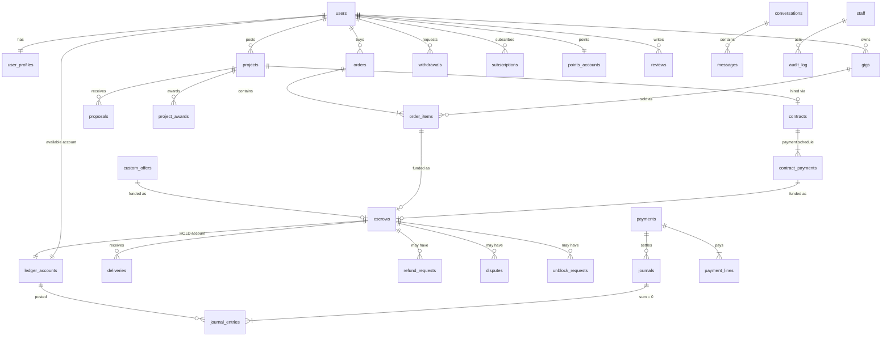
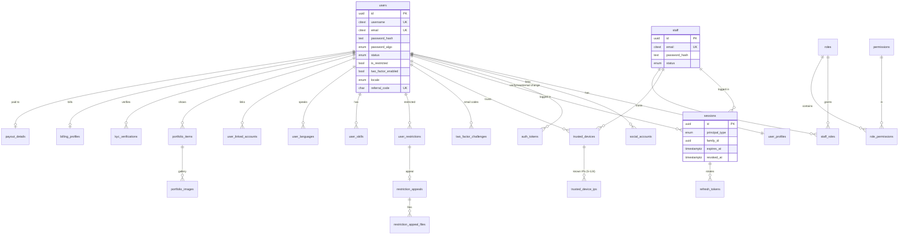
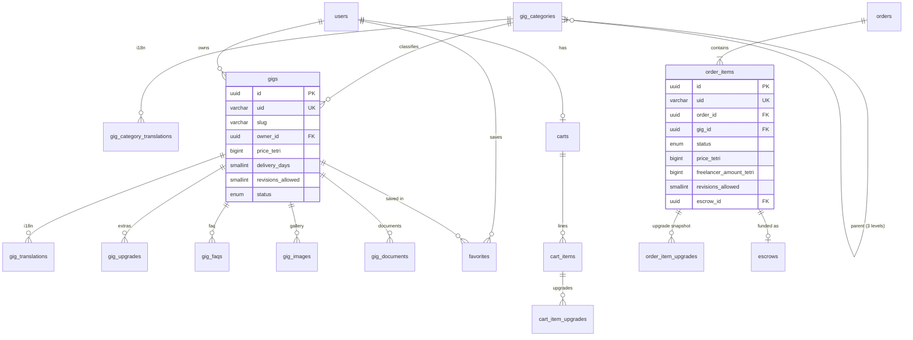
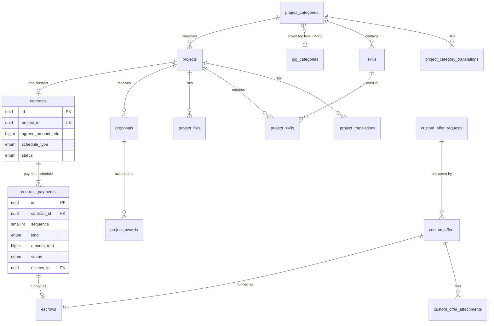
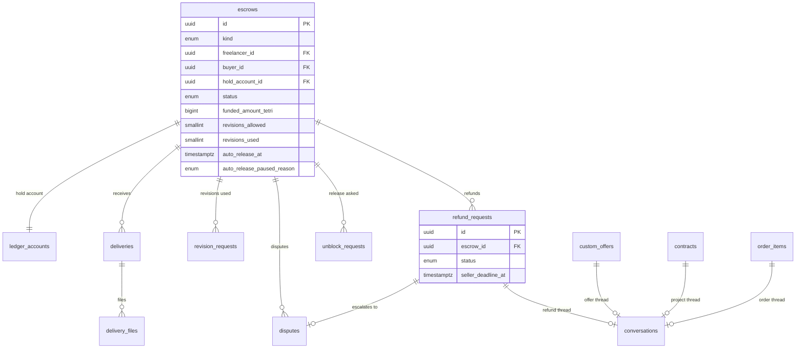
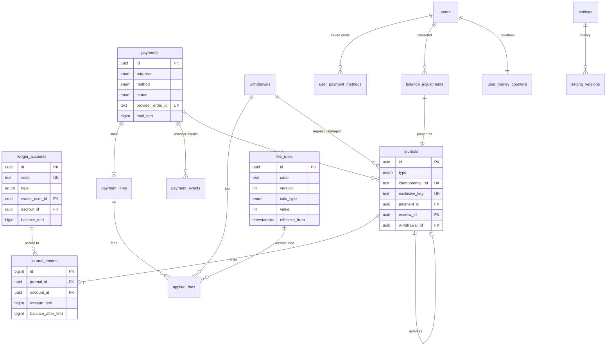
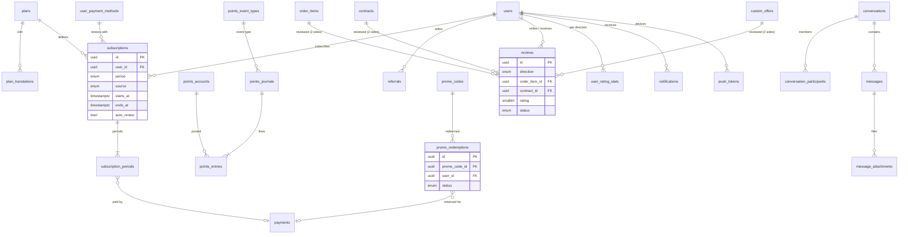

# Data model — MyTask.ge rebuild
Status: **proposed** (waiting for Owner review) | Author: solution-architect (P2-B2) | Date: 2026-09-28
Inputs: `architecture.md`, ADR-001…016 (as revised 2026-09-28), approved specs `docs/02-specs/00` (register S-001…S-126), 01–07, 09, 14; Owner answers Q-002…Q-094 (authoritative); `docs/01-discovery/data-model.md` (legacy schema, 230 migrations); `routes-and-pages.md`.
Specs 08, 10, 11, 12 and 13 were written in parallel (status "ready for Owner" when this model was finished). The model was first built from the Owner answers (Q-005, Q-012, Q-015, Q-020, Q-027, Q-034…Q-037, Q-050, Q-056, Q-060, Q-065, Q-067, Q-071) and discovery, then **aligned with those drafts** (statuses, custom-offer escrow, conversation kinds, MM-11/12/13 rows). Parts marked **"to confirm against spec NN"** must be re-checked if the Owner changes those drafts. No business rule is invented here.

This document is the design source for `apps/api/prisma/schema.prisma` (Phase 3) and for the legacy ETL `tools/migrate-legacy` (Phase 5). If this document and an ADR disagree, the ADR wins and this document is fixed.

Contents
1. Conventions
2. ER diagrams (Mermaid)
3. Entities by domain (columns, types, keys, indexes, statuses)
4. Enums and state machines
5. The money ledger (accounts, journals, posting rules)
6. Money invariants
7. Mapping of every MM-/PM- row to ledger postings
8. Points ledger
9. Settings, fee rules and snapshots (how old transactions keep their fee)
10. Timers as deadline columns
11. Extensibility: milestones and hourly work
12. Legacy → new mapping outline
13. Entity count

---

## 1. Conventions

| Topic | Rule |
|---|---|
| Database | PostgreSQL 17 with extensions `pg_trgm`, `btree_gist`, `citext`, `pgvector` (installed, unused at launch). Prisma schema; typed raw SQL for locking, sweepers, ledger posting and search (ADR-001). |
| Names | Tables `snake_case`, plural. Columns `snake_case`. Foreign keys `<entity>_id`. |
| Primary keys | `id uuid` generated by the application as **UUIDv7** (time-ordered, index-friendly, no collisions; fixes R-038). High-volume append-only tables (`journal_entries`, `points_entries`, `audit_log`, `analytics_events`, `payment_events`, `outbox_events`, `system_log`) use `bigint` identity. |
| Public identifiers | Kept from legacy for SEO and support: `gigs.uid` (20 characters, legacy format, used in `/service/{slug}-{uid}`), `projects.pid` (6 digits, `/project/{pid}/{slug}`), `order_items.uid`, `custom_offers.uid`, `refund_requests.uid`. New readable numbers: `orders.number`, `withdrawals.number` (bigint sequences starting above the legacy maximum). Internal uuids are never shown as order numbers. |
| Money | `bigint`, integer **tetri**, column suffix `_tetri`. One currency, `GEL` (P-13): money tables carry `currency char(3) NOT NULL DEFAULT 'GEL' CHECK (currency = 'GEL')` where a row stands alone (ledger accounts, payments, withdrawals). No floats, no `numeric` for money. |
| Percentages | Integer **basis points** (`250` = 2.5%). Applied with integer maths, rounded half up to the tetri (R-3.8). |
| Time | `timestamptz`, stored in UTC. Durations from the register are stored as integers (hours, days) next to the deadline they produced. |
| Status columns | PostgreSQL enums (generated by Prisma). State transitions are compare-and-set (`UPDATE … WHERE id = $1 AND status = $expected`), inside the same transaction as any ledger posting (ADR-003 §5). |
| Soft delete | `deleted_at` only where a spec needs it: `users` (email/username stay reserved), `gigs` (status `deleted` + `deleted_at`), `gig_upgrades`, `user_payment_methods`, `files`. Everything else is either immutable or hard-deleted by an explicit rule. |
| Legacy link | Every migrated table has `legacy_id bigint NULL` (plus `legacy_source` where two legacy tables merge into one). `UNIQUE (legacy_source, legacy_id)` makes the ETL idempotent (re-runnable). The columns stay after cutover for support look-ups. |
| Translations | Translatable content lives in `<entity>_translations` with `PRIMARY KEY (<entity>_id, locale)` and the **provenance block** `TM` = `source translation_source NOT NULL DEFAULT 'human'` (`human` \| `machine`), `source_locale locale NULL` (language it was machine-translated from), `source_hash bytea NULL` (SHA-256 of the source fields at translation time; a mismatch means "stale"), `updated_at`, `updated_by_user_id NULL`, `updated_by_staff_id NULL`. AI translation later fills rows with `source = machine` without schema changes (ADR-006). The API falls back to `ka` and returns `contentLocale` (Q-023). |
| Files | Every uploaded or migrated file is a `files` row (ADR-009). Other tables reference it by `*_file_id` (1:1) or through a small join table with `position` (ordered lists). |
| Snapshots | Anything a later action depends on (price, fees and fee-rule versions, delivery time, revisions, timer durations, payout details, plan) is **copied onto the transaction row when it is created** (00 AC-9, EC-2). §9 lists every snapshot. |
| Writes that must notify | Business code writes an `outbox_events` row in the same transaction; the worker dispatches it to BullMQ (email, push, in-app, realtime). A rolled-back transaction therefore never sends a notification. |

Abbreviations in the column tables: **PK** primary key, **FK** foreign key, **UK** unique, **IX** index, **PIX** partial index, **CK** check constraint. "→ x" in the FK column means "references x".

---

## 2. ER diagrams (Mermaid)

The model has 120 entities (§13), so it is drawn as one core overview and six domain diagrams. Attribute lists in the diagrams show keys and the most important columns only; §3 has every column.

### 2.1 Core overview


### 2.2 Identity, profiles, staff


### 2.3 Catalog, gigs, cart, gig orders


### 2.4 Projects, proposals, contracts, custom offers (specs 10, 11, 12)


### 2.5 Escrow, delivery, refunds, disputes, unblock requests


### 2.6 Ledger, payments, withdrawals, settings


### 2.7 Subscriptions, points, promo codes, reviews, chat, notifications


---

## 3. Entities by domain

### 3.A Identity and access (ADR-002, spec 01)

**users** — one account, both roles (Q-013)
| Column | Type | Keys / constraints | Notes |
|---|---|---|---|
| id | uuid | PK | |
| legacy_id | bigint | UK null | legacy `users.id` |
| username | citext | UK, CK `^[a-zA-Z0-9_]{3,60}$` and not only digits | UK includes deleted rows (stays reserved, spec 01 R-A1) |
| email | citext | UK, ≤ 60 | includes deleted rows |
| email_verified_at | timestamptz | null | |
| password_hash | text | null | null = social-only account |
| password_algo | password_algo | null, CK set when hash set | `bcrypt_legacy` (migrated `$2y$`) → `argon2id` after first login (ADR-002) |
| password_changed_at | timestamptz | null | |
| status | user_status | not null, default `pending` | `pending`, `active`, `verified`, `banned` (legacy values) |
| is_restricted | boolean | default false | cached flag = an open `user_restrictions` row exists; maintained in the same transaction |
| two_factor_enabled | boolean | default false | user choice, kept when S-056 is OFF (Q-072) |
| locale | locale | default `ka` | used for emails/push (ADR-006) |
| theme | theme_pref | null | `light`/`dark`/`system` (Q-059, Q-093); null = S-106 |
| last_dashboard | dashboard | default `buying` | shared by web and mobile (spec 02 P-22) |
| referral_code | char(8) | UK, CK `^[A-Z0-9]{8}$` | spec 01 AC-1 |
| last_activity_at | timestamptz | null | written at most once a minute; presence itself in Redis (BR-012) |
| banned_at | timestamptz | null | |
| created_at, updated_at | timestamptz | | |
| deleted_at | timestamptz | null | soft delete (spec 02 AC-34) |
IX: `(status) WHERE deleted_at IS NULL`; trigram IX on `username` for staff search.

**user_profiles** (1:1 with users) — public profile data (spec 02)
`user_id uuid PK FK→users` · `fullname varchar(60)` · `headline varchar(100) null` · `about varchar(1500) null` · `avatar_file_id uuid null FK→files` · `country_id smallint null FK→countries` · `city varchar(60) null` · `timezone varchar(64) null` · `unavailable_until timestamptz null` · `unavailable_message varchar(750) null` · `last_delivery_at timestamptz null` (cache) · `updated_at`. PIX `unavailable_until WHERE unavailable_until IS NOT NULL` (daily reset sweeper, BR-013).

**social_accounts** — `id` PK · `user_id` FK→users · `provider social_provider` (`google`, `facebook`, `github`, `linkedin`, `twitter`) · `provider_user_id text` · `email citext` · `avatar_url text null` · `created_at`. UK `(provider, provider_user_id)`; IX `user_id`.

**auth_tokens** — one-time links (verification, reset, email change)
`id` PK · `user_id` FK · `purpose auth_token_purpose` (`email_verification`, `password_reset`, `email_change`) · `token_hash bytea UK` (SHA-256; the raw token only in the email) · `new_email citext null` (email change, spec 02 P-18) · `expires_at` (snapshot of S-054/S-055) · `consumed_at null` · `created_ip inet` · `created_at`. IX `(user_id, purpose)`. Issuing a new token invalidates older ones of the same purpose (spec 01 AC-9, AC-32).

**sessions** — one row per login on one device (web, admin, iOS, Android)
| Column | Type | Keys / constraints | Notes |
|---|---|---|---|
| id | uuid | PK | JWT claim `sid` |
| principal_type | principal_type | not null | `user` / `staff` (JWT `aud`) |
| user_id | uuid | FK null | CK exactly one of user_id / staff_id |
| staff_id | uuid | FK null | |
| family_id | uuid | not null | reuse of an old refresh token revokes the family |
| client | client_kind | not null | `web`, `admin`, `ios`, `android` |
| device_id_hash | bytea | not null | hash of the device identifier (cookie / install id) |
| user_agent, device_label | text | | shown in the session list (spec 01 AC-43) |
| ip | inet | | last IP |
| created_at, last_used_at, expires_at | timestamptz | | user 30 days sliding, staff 12 h (ADR-002) |
| revoked_at | timestamptz | null | |
| revoke_reason | session_revoke_reason | null | `logout`, `password_change`, `ban`, `user_revoked`, `reuse_detected`, `staff_revoked`, `twofa_disabled` |
PIX `(user_id) WHERE revoked_at IS NULL`, `(staff_id) WHERE revoked_at IS NULL`.

**refresh_tokens** — `id` PK · `session_id` FK · `token_hash bytea UK` · `issued_at` · `used_at null` · `replaced_by_id uuid null`. A presented hash with `used_at IS NOT NULL` ⇒ revoke all sessions of the family (theft detection). Rows older than the session expiry are deleted nightly.

**trusted_devices** — 2FA trust (spec 01 AC-22…AC-31, S-059, S-124)
`id` PK · `principal_type` · `user_id null` · `staff_id null` · `device_id_hash bytea` · `first_trusted_at` · `trusted_until` (snapshot of S-059) · `last_seen_at` · `user_agent`. UK `(principal_type, coalesce(user_id, staff_id), device_id_hash)`.

**trusted_device_ips** — IPs confirmed on a trusted device, used only when S-124 = `new_device_or_ip`
`trusted_device_id` FK · `ip inet` · `trusted_until` · `created_at`. PK `(trusted_device_id, ip)`. With S-124 = `new_device` the IP table is written but not checked, so switching the setting needs no data change.

**two_factor_challenges** — `id` PK · `principal_type`, `user_id`, `staff_id` · `purpose twofa_purpose` (`login`, `toggle_two_factor`) · `code_hash bytea` · `device_id_hash bytea` · `ip inet` · `attempts smallint default 0` · `max_attempts smallint` (snapshot S-058) · `expires_at` (snapshot S-057) · `consumed_at null` · `invalidated_at null` · `created_at`. IX `(user_id, created_at)`. Resend cooldown and the 5-per-15-minutes cap are Redis counters (spec 01 R-A6).

**banned_ips** — staff-login IP ban (S-064, spec 01 AC-51/52)
`ip inet PK` · `failed_attempts int` · `banned_at timestamptz null` (null = counting, not banned) · `source ban_source` (`auto_threshold`, `manual`) · `note text null` · `created_by_staff_id null` · `created_at`, `updated_at`. User login throttling (S-062/S-063) is in Redis, not here.

**user_restrictions** — `id` PK · `legacy_id` · `user_id` FK · `message text` · `files_required boolean` · `status restriction_status` (`pending`, `submitted`, `approved`, `rejected`) · `created_by_staff_id` · `created_at` · `resolved_by_staff_id null` · `resolved_at null` · `deleted_at null` (staff delete, spec 01 AC-50). PIX `(user_id) WHERE deleted_at IS NULL AND status IN ('pending','submitted','rejected')` drives `users.is_restricted`.

**restriction_appeals** — `id` PK · `restriction_id` FK **UK** (one appeal per restriction) · `message varchar(1500)` · `created_at`.
**restriction_appeal_files** — `appeal_id` FK · `file_id` FK→files (bucket `private`) · `position smallint`. PK `(appeal_id, file_id)`.

### 3.B Profiles, KYC, reports (spec 02)

**user_skills** — `id` PK · `user_id` FK · `name varchar(30)` · `slug varchar(60)` · `experience skill_level` (`beginner`, `intermediate`, `pro`; shown as Beginner/Intermediate/Expert) · `created_at`. UK `(user_id, lower(name))`; IX `slug`; trigram IX on `slug`, `name` (`/hire/{keyword}`, spec 03 AC-28).
**user_languages** — `id` PK · `user_id` FK · `name varchar(100)` · `level language_level` (`basic`, `conversational`, `fluent`, `native`). UK `(user_id, lower(name))`.
**user_linked_accounts** — `user_id` FK · `provider linked_provider` (`facebook`, `twitter`, `dribbble`, `stackoverflow`, `github`, `youtube`, `vimeo`) · `url varchar(160)`. PK `(user_id, provider)`. Shown only when S-123 is ON.

**portfolio_items** — `id` PK · `legacy_id` · `uid varchar(20) UK` · `user_id` FK · `slug varchar(160)` (title slug + uid) · `title varchar(100)` · `description text` · `project_url varchar(120) null` · `video_url varchar(120) null` · `thumbnail_file_id` FK · `status portfolio_status` (`pending`, `active`) · `published_at null` · `created_at`, `updated_at`. IX `(user_id, status)`. Hard delete with files (spec 02 AC-27).
**portfolio_images** — `portfolio_item_id` FK · `file_id` FK · `position smallint`. PK `(portfolio_item_id, file_id)`.

**kyc_verifications** (Q-048, S-122) — `id` PK · `legacy_id` · `user_id` FK · `document_type kyc_document_type` (`national_id`, `driver_license`, `passport`) · `front_file_id` FK · `back_file_id null` (passport) · `selfie_file_id` FK · `status kyc_status` (`pending`, `verified`, `declined`) · `provider kyc_provider` (`manual`; future values) · `provider_reference text null` · `reviewed_by_staff_id null` · `reviewed_at null` · `created_at`. PIX UK `(user_id) WHERE status IN ('pending','verified')` (one active verification, spec 02 AC-38). Files in bucket `kyc`.

**billing_profiles** — `user_id` PK FK · `firstname`, `lastname`, `company`, `address varchar(255)` · `country_id null` · `vat_number varchar(50) null` · `updated_at`. Copied into `payments.billing_snapshot` at payment time (spec 05 AC-36).

**countries** — `id smallint PK` · `iso2 char(2) UK` · `name_ka`, `name_en varchar(100)` · `is_active boolean`. Reference data, not user content (no provenance block).

**reports** — one table for user, gig, project and proposal reports
`id` PK · `legacy_source`, `legacy_id` · `reporter_user_id` FK · `target_type report_target` (`user`, `gig`, `project`, `proposal`) · `target_id uuid` · `reason varchar(1500)` · `status report_status` (`pending`, `seen`, `resolved`) · `handled_by_staff_id null` · `handled_at null` · `created_at`, `updated_at`. UK `(reporter_user_id, target_type, target_id)` (profile reports upsert, spec 02 AC-14; a second gig report is refused, spec 04 AC-37). IX `(target_type, target_id)`, `(status, created_at)`.

### 3.C Catalog (spec 03)

**gig_categories** — the three legacy tables merged into one tree
| Column | Type | Keys / constraints | Notes |
|---|---|---|---|
| id | uuid | PK | |
| parent_id | uuid | FK→gig_categories null | null for top level |
| depth | smallint | CK 1..3; trigger: depth = parent.depth + 1 | 1 category, 2 sub-category, 3 child category |
| slug | varchar(160) | UK `(depth, slug)` | legacy slugs were unique per table |
| position | int | | |
| is_visible | boolean | default true | home rows only (spec 03 AC-5) |
| icon_file_id, image_file_id | uuid | FK null | top level |
| legacy_source | enum | `categories`, `subcategories`, `childcategories` | |
| legacy_id | bigint | UK with legacy_source | |
| created_at, updated_at | timestamptz | | |
IX `parent_id`. Delete is refused while gigs, children or projects reference it (spec 03 EC-2; FK `ON DELETE RESTRICT`).

**gig_category_translations** — PK `(category_id, locale)` · `name varchar(100)` · `content_top text null` · `content_bottom text null` (SEO text) · TM.
**project_categories** — `id` PK · `legacy_id` · `slug varchar(160) UK` · `gig_category_id uuid null FK→gig_categories` (top level; CK depth 1 by trigger; "notify freelancers in the category", BR-053, P-31) · `image_file_id null` · `position` · `is_active` · timestamps.
**project_category_translations** — PK `(project_category_id, locale)` · `name varchar(100)` · `seo_description text null` · TM.
**skills** — project skills (P-31) · `id` PK · `legacy_id` · `project_category_id` FK · `slug varchar(100)` · `is_active` · timestamps. UK `(project_category_id, slug)`.
**skill_translations** — PK `(skill_id, locale)` · `name varchar(100)` · TM.

### 3.D Gigs (spec 04)

**gigs**
| Column | Type | Keys / constraints | Notes |
|---|---|---|---|
| id | uuid | PK | |
| legacy_id | bigint | UK null | |
| uid | varchar(20) | UK | legacy uid kept; new gigs get 20 uppercase hex characters (same format as live) |
| slug | varchar(160) | not null | transliterated Georgian title (≤ 138) + `-` + uid (P-33); resolved by the uid suffix, so old slugs need no history table (url-map §4) |
| owner_id | uuid | FK→users | |
| category_id, subcategory_id, childcategory_id | uuid | FK→gig_categories, all required | trigger checks depth 1/2/3 and parent chain |
| price_tetri | bigint | CK ≥ 100 | ≥ 1.00 GEL (P-35) |
| delivery_days | smallint | CK IN (0,1,2,3,4,5,6,7,14,21,30) | fixed list (00 §4.18) |
| revisions_allowed | smallint | CK 0..100; null only when `legacy_id IS NOT NULL` | range 0…S-041 checked at save (Q-056, P-1). Migrated gigs: see Owner question 1 in the handoff |
| status | gig_status | default `pending` | `pending`, `active`, `rejected`, `deleted` (R-G5) |
| rejection_reason | text | null | |
| thumbnail_file_id | uuid | FK→files | |
| seo_title | varchar(100) | null | saved only together with seo_description |
| seo_description | varchar(150) | null | |
| video_url | text | null | legacy value kept for data preservation; not shown (P-32) |
| visits_count, impressions_count | bigint | default 0 | |
| sales_count | int | default 0 | +1 on completion (R-O7) |
| orders_in_queue | int | CK ≥ 0 | paid, unfinished items (R-G8) |
| rating_count | int | default 0 | visible `about_freelancer` reviews of this gig (spec 07 R-V5) |
| rating_sum | int | default 0 | average = sum / count, exact; displayed with one decimal (P-56) |
| published_at | timestamptz | null | "newest" sort |
| created_at, updated_at | timestamptz | | |
| deleted_at | timestamptz | null | status `deleted` |
IX `(owner_id) WHERE status <> 'deleted'` (plan-limit count, R-G3); `(status, published_at DESC)`; `category_id`, `subcategory_id`, `childcategory_id`.

**gig_translations** — PK `(gig_id, locale)` · `title varchar(100)` · `description text` (sanitised HTML) · TM. The `ka` row is required.
**gig_upgrades** — `id` PK · `legacy_id` · `gig_id` FK · `title varchar(100)` · `price_tetri` CK ≥ 100 · `extra_days smallint` (delivery list) · `position` · `deleted_at null`. Max 10 active per gig (app rule, R-G9).
**gig_faqs** — `id` PK · `gig_id` FK · `question varchar(100)` · `answer varchar(300)` · `position`. Max 10.
**gig_images** / **gig_documents** — `gig_id` FK · `file_id` FK · `position smallint`. PK `(gig_id, file_id)`, UK `(gig_id, position)`. Documents are public downloads (R-G11, bucket `public-media`).
**favorites** — `user_id` FK · `gig_id` FK · `created_at`. PK `(user_id, gig_id)`.

### 3.E Cart (spec 06 AC-1…AC-6, P-47)
A logged-in user's cart is on the server (shared by web and mobile); a guest cart stays on the device and is merged at login.
**carts** — `user_id uuid PK FK` · `updated_at`.
**cart_items** — `id` PK · `user_id` FK→carts · `gig_id` FK · `added_at`. UK `(user_id, gig_id)` (adding again replaces the line). No price column: prices are always re-read (spec 06 AC-6).
**cart_item_upgrades** — `cart_item_id` FK · `gig_upgrade_id` FK. PK both.

### 3.F Gig orders (spec 06)

**orders** — one checkout
| Column | Type | Keys / constraints | Notes |
|---|---|---|---|
| id | uuid | PK | |
| number | bigint | UK (sequence) | shown to users |
| legacy_uid | varchar(40) | UK null | legacy `orders.uid` (`b_…` for BOG) |
| legacy_id | bigint | UK null | |
| buyer_id | uuid | FK→users | |
| status | order_status | default `awaiting_payment` | `awaiting_payment`, `paid`, `deleted` (AC-11: delete moves no money; the row is kept for audit) |
| subtotal_tetri | bigint | CK ≥ 0 | Σ item prices P |
| paid_payment_id | uuid | FK→payments null | the payment that paid it (retries create new payments, P-53a) |
| created_at, paid_at, deleted_at | timestamptz | | |
IX `(buyer_id, created_at DESC)`.

**order_items** — one gig line = one delivery flow = one review per side (P-46, Q-045)
| Column | Type | Keys / constraints | Notes |
|---|---|---|---|
| id | uuid | PK | |
| uid | varchar(20) | UK | used in `/account/orders/{uid}` |
| legacy_id | bigint | UK null | |
| order_id | uuid | FK→orders | |
| gig_id | uuid | FK→gigs | |
| seller_id | uuid | FK→users | freelancer |
| buyer_id | uuid | FK→users | denormalised for policies |
| status | order_item_status | | §4 |
| gig_title_ka, gig_title_en | varchar(100) | en null | snapshot |
| base_price_tetri | bigint | | snapshot |
| upgrades_price_tetri | bigint | default 0 | snapshot |
| price_tetri | bigint | CK = base + upgrades | **P** |
| freelancer_amount_tetri | bigint | CK 0 < P′ ≤ P | **P′** (P minus freelancer-paid fees; today = P) |
| buyer_fee_tetri | bigint | default 0 | **Fb** share (today 0) |
| delivery_days | smallint | | snapshot |
| extra_days_total | smallint | | snapshot of upgrades' extra days |
| revisions_allowed | smallint | | snapshot (R-O2); copied to the escrow at funding |
| order_details | text | null, ≤ 5,000 | sanitised HTML (P-48) |
| order_details_sent_at | timestamptz | null | |
| started_at | timestamptz | null | |
| expected_delivery_at | timestamptz | null | start + delivery_days + extra_days_total |
| completed_at | timestamptz | null | |
| completed_by | completion_actor | null | `buyer`, `system`, `staff` |
| canceled_at | timestamptz | null | |
| canceled_by | cancel_actor | null | `buyer`, `freelancer`, `staff` |
| refunded_at | timestamptz | null | |
| escrow_id | uuid | FK→escrows UK null | set when funded |
| legacy_requirements | jsonb | null | legacy `order_item_requirements` answers, read-only |
| created_at, updated_at | timestamptz | | |
IX `(buyer_id, created_at DESC)`, `(seller_id, status)`, `(gig_id) WHERE status IN ('paid','in_progress','delivered','revision_requested')`.

**order_item_upgrades** — `id` PK · `order_item_id` FK · `gig_upgrade_id null` FK · `title varchar(100)` · `price_tetri` · `extra_days` (snapshot; fixes R-036).

### 3.G Projects, proposals, awards, contracts (specs 10 and 11)

**projects**
| Column | Type | Keys / constraints | Notes |
|---|---|---|---|
| id | uuid | PK | |
| legacy_id | bigint | UK null | |
| pid | int | UK, CK 100000..999999 | URL id (kept) |
| slug | varchar(160) | | |
| client_id | uuid | FK→users | |
| project_category_id | uuid | FK→project_categories | |
| budget_type | budget_type | default `fixed`; CK `budget_type = 'fixed' OR legacy_id IS NOT NULL` | `hourly` exists only for migrated history (Q-035) |
| budget_min_tetri, budget_max_tetri | bigint | CK min ≤ max | proposal amount must be inside (BR-055) |
| status | project_status | | §4.4 (spec 10 R-P3) |
| rejection_reason | text | null | |
| thumbnail_file_id | uuid | FK | required (BR-051) |
| proposals_count, visits_count | int | default 0 | |
| published_at, closed_at | timestamptz | null | |
| created_at, updated_at | timestamptz | | |
IX `(status, published_at DESC)`, `(client_id, status)`, `project_category_id`.

**project_translations** — PK `(project_id, locale)` · `title varchar(100)` · `description text` · TM.
**project_skills** — `project_id`, `skill_id`, PK both. Max S-076 (app rule).
**project_files** — `project_id`, `file_id`, `position`. PK `(project_id, file_id)`.

**proposals** (legacy `project_bids`)
`id` PK · `legacy_id` · `uid varchar(20) UK` · `project_id` FK · `freelancer_id` FK · `amount_tetri` · `delivery_days int` · `revisions_allowed smallint` (Q-056; null only for migrated rows) · `message varchar(3500)` · `status proposal_status` (§4) · `admin_rejection_reason text null` · `created_at`, `updated_at`. UK `(project_id, freelancer_id)` (BR-055). IX `(freelancer_id, created_at DESC)`, `(project_id, status)`. The Premium requirement (Q-020) is a policy check at insert, not a column.

**project_awards** — one row per award attempt (48h acceptance, Q-005, S-027)
`id` PK · `project_id` FK · `proposal_id` FK · `freelancer_id` FK · `status award_status` (`pending`, `accepted`, `declined`, `expired`, `revoked`) · `awarded_at` · `expires_at` · `acceptance_hours_used smallint` (snapshot S-027) · `responded_at null` · `decline_reason_codes smallint[] null` (legacy reason_1…8) · `decline_note text null` · `revoked_at null`. PIX UK `(project_id) WHERE status IN ('pending','accepted')`; PIX `expires_at WHERE status = 'pending'` (sweeper).

**contracts** — the work contract of a project, created when the awarded freelancer accepts (spec 11 R-H5) with a snapshot of the proposal. It carries the **payment schedule** (§11). Custom offers do not use contracts: spec 12 lets the buyer pay a `sent` offer directly, so the offer row itself is the agreement and owns its escrow (§3.H).
| Column | Type | Keys / constraints | Notes |
|---|---|---|---|
| id | uuid | PK | |
| project_id | uuid | FK UK | one active contract per project (Q-050); a canceled hire (spec 11 AC-25) keeps its row, so the UK is partial: `WHERE status <> 'canceled'` |
| proposal_id, award_id | uuid | FK | |
| client_id, freelancer_id | uuid | FK→users, CK different | |
| title_snapshot | varchar(160) | | for lists and receipts |
| agreed_amount_tetri | bigint | CK > 0 | proposal amount P |
| delivery_days | int | | snapshot |
| revisions_allowed | smallint | | snapshot (Q-056) |
| schedule_type | schedule_type | default `single_payment` | `single_payment` only at launch; `milestones`, `hourly` reserved (Q-035, Q-036) |
| status | contract_status | | spec 11 R-H5: `awaiting_payment`, `in_progress`, `delivered`, `revision_requested`, `completed`, `refunded`, `canceled` |
| expected_delivery_at | timestamptz | null | funded_at + delivery_days ("Late" chip; refund eligibility, spec 13) |
| created_at, started_at, completed_at | timestamptz | | |
| legacy_id | bigint | null | |
IX `(client_id, status)`, `(freelancer_id, status)`.

**contract_payments** — the schedule lines. **Today exactly one line per contract** (`sequence = 1`, `kind = full`, amount = agreed amount): "one escrow payment per project" (Q-034, Q-050).
| Column | Type | Keys / constraints | Notes |
|---|---|---|---|
| id | uuid | PK | |
| contract_id | uuid | FK | |
| sequence | smallint | UK `(contract_id, sequence)` | |
| kind | contract_payment_kind | default `full` | `full`; reserved `milestone`, `hourly_period` |
| title | varchar(160) | null | milestone title later |
| amount_tetri | bigint | CK > 0 | **P** |
| freelancer_amount_tetri | bigint | CK ≤ P | **P′** (S-015 / S-018 freelancer commission; today = P) |
| buyer_fee_tetri | bigint | default 0 | **Fb** (S-014 / S-017; today 0) |
| status | contract_payment_status | | `awaiting_payment`, `funded`, `released`, `refunded`, `canceled` |
| escrow_id | uuid | FK UK null | set when funded |
| paid_payment_id | uuid | FK→payments null | |
| period_start, period_end | timestamptz | null | reserved for hourly |
| due_at | timestamptz | null | reserved for milestones |
| created_at, funded_at, closed_at | timestamptz | | |
| legacy_milestone_id | bigint | UK null | legacy `project_milestones.id` (Q-050) |
Launch rule enforced by the API (and a DB trigger while `schedule_type = 'single_payment'`): one row, sequence 1, kind `full`.

### 3.H Custom offers (spec 12)
Rules: freelancers create offers, buyers create requests (R-C1, Q-060a); no admin approval by default (S-035 OFF); expiry 3 days (S-036, R-C6); fees in the Commission & Fee module, OFF (S-017/S-018, P-6); revisions field (P-3); plan limit counts only if S-007 is ON (P-9). The buyer pays a `sent` offer directly (R-C4), so the offer row is the agreement: it keeps the snapshot and, once paid, owns its **own escrow** (one HOLD account per custom offer, R-C7).

**custom_offer_requests** (R-C5) — `id` PK · `buyer_id` FK · `freelancer_id` FK · `conversation_id null` FK · `description varchar(2500)` · `budget_idea_tetri null` · `wished_days int null` · `status offer_request_status` (`open`, `answered`, `declined`, `canceled`) · `created_at` · `responded_at null`. IX `(freelancer_id, status)`. No expiry; not counted in plan limits.

**custom_offers**
| Column | Type | Keys / constraints | Notes |
|---|---|---|---|
| id | uuid | PK | |
| legacy_id | bigint | UK null | |
| uid | varchar(36) | UK | legacy uuid kept |
| freelancer_id, buyer_id | uuid | FK, CK different | author/seller and recipient/payer |
| request_id | uuid | FK null | answered request |
| conversation_id | uuid | FK null | the direct conversation it was sent in (R-C2) |
| description | varchar(2500) | | |
| price_tetri | bigint | CK ≥ 100 | **P** (≥ 1.00 GEL, R-C3) |
| freelancer_amount_tetri | bigint | CK ≤ P | **P′** (S-018 snapshot at sending; today = P) |
| buyer_fee_tetri | bigint | default 0 | **Fb** (S-017 snapshot) |
| fee_rule_ids | uuid[] | | fee-rule versions snapshotted at sending (R-C3); the `applied_fees` rows are written with the payment |
| delivery_days | int | CK 1..365 | |
| revisions_allowed | smallint | | 0…S-041 |
| status | custom_offer_status | | §4.5 |
| expires_at | timestamptz | | sent (or approved) + S-036 days |
| expiry_days_used | smallint | | snapshot |
| admin_rejection_reason, decline_reason | text | null | |
| sent_at, responded_at, paid_at, canceled_at | timestamptz | null | |
| escrow_id | uuid | FK UK null | set when paid |
| expected_delivery_at | timestamptz | null | paid_at + delivery_days |
| created_at, updated_at | timestamptz | | |
PIX `expires_at WHERE status = 'sent'` (expiry sweeper); IX `(freelancer_id, status)`, `(buyer_id, status)`.
**custom_offer_attachments** — `offer_id`, `file_id`, `position` (S-037…S-040). PK `(offer_id, file_id)`.

### 3.I Escrow, delivery, revisions, refunds, disputes, unblock requests
**Design choice.** An **escrow** is the protected unit of work and money shared by the three things a buyer pays for: one gig order item, one contract payment (project), or one custom offer. The escrow owns the HOLD ledger account, the delivery history, the revision counter and the auto-release timer. So there is one auto-release sweeper, one delivery/revision implementation and one refund/dispute/unblock implementation for gigs, projects and offers (Q-037, Q-067a). The business row (order item, contract payment) keeps its own status for the screens.

**escrows**
| Column | Type | Keys / constraints | Notes |
|---|---|---|---|
| id | uuid | PK | |
| kind | escrow_kind | not null | `gig_order_item`, `contract_payment`, `custom_offer`, `legacy_hold` (migration only, §12.3) |
| order_item_id | uuid | FK UK null | |
| contract_payment_id | uuid | FK UK null | |
| custom_offer_id | uuid | FK UK null | CK: exactly the one FK that matches `kind`; none for `legacy_hold` |
| buyer_id | uuid | FK→users null | null only for `legacy_hold` |
| freelancer_id | uuid | FK→users | payee (the owner for `legacy_hold`) |
| hold_account_id | uuid | FK→ledger_accounts UK | `escrow:{id}:hold` |
| status | escrow_status | default `funded` | `funded` → `released` or `refunded`. A closed escrow accepts no postings |
| funded_amount_tetri | bigint | CK ≥ 0 | = P′ at funding |
| funded_at, closed_at | timestamptz | | |
| close_reason | escrow_close_reason | null | `completed_by_buyer`, `auto_release`, `admin_release`, `unblock_approved`, `dispute_release`, `canceled_before_start`, `refund_accepted_by_seller`, `refund_accepted_by_admin`, `dispute_refund`, `legacy_settlement` |
| revisions_allowed | smallint | | copied from the item snapshot |
| revisions_used | smallint | CK 0 ≤ used ≤ allowed | |
| delivery_count | smallint | default 0 | |
| last_delivered_at | timestamptz | null | |
| auto_release_at | timestamptz | null | deadline (§10) |
| auto_release_hours_used | smallint | null | S-026 value used for the current deadline (EC-2) |
| auto_release_set_reason | auto_release_reason | null | `delivery`, `redelivery`, `refund_ended`, `reenabled` (Q-084), `migration` (P-53b) |
| auto_release_paused_reason | auto_release_pause | null | `revision_requested`, `refund_open`, `dispute_open` |
| refund_open | boolean | default false | |
| dispute_open | boolean | default false | |
| created_at, updated_at | timestamptz | | |

Indexes: `(freelancer_id) WHERE status = 'funded'` (HOLD list, spec 05 AC-28); `(buyer_id) WHERE status = 'funded'`; PIX `auto_release_at WHERE status = 'funded' AND auto_release_at IS NOT NULL AND auto_release_paused_reason IS NULL` (sweeper).

**deliveries** (append-only, R-O9): `id` PK · `legacy_source`, `legacy_id` · `escrow_id` FK · `number smallint` · `message varchar(2500)` · `delivered_by_user_id` FK · `created_at`. UK `(escrow_id, number)`.

**delivery_files**: `delivery_id`, `file_id`, `position`. PK `(delivery_id, file_id)`. Gig orders allow at most 1 file (S-086/S-087, P-49). Project and offer deliveries follow the same rule: at most 1 file (spec 11 AC-32, spec 12 R-C8).

**revision_requests**: `id` PK · `escrow_id` FK · `number smallint` · `message varchar(750)` · `requested_by_user_id` · `created_at` · `answered_by_delivery_id null` FK. UK `(escrow_id, number)`. The insert increments `escrows.revisions_used` in the same transaction (P-50).

**refund_requests** (spec 13 R-R3; legacy statuses kept)
| Column | Type | Keys / constraints | Notes |
|---|---|---|---|
| id | uuid | PK | |
| uid | varchar(20) | UK | |
| legacy_source | enum | `refunds`, `project_refunds` | |
| legacy_id | bigint | | |
| escrow_id | uuid | FK | |
| buyer_id, freelancer_id | uuid | FK | |
| reason | text | | |
| status | refund_status | | `pending`, `accepted_by_seller`, `rejected_by_seller`, `accepted_by_admin`, `rejected_by_admin`, `closed` |
| closed_by | refund_closed_by | null | `buyer`, `system` (item completed), `staff` ("Release funds") |
| disputed | boolean | default false | the dispute flag (legacy `request_admin_intervention`); details in `disputes` |
| seller_deadline_at | timestamptz | | created_at + S-030 days (snapshot) |
| response_days_used | smallint | | |
| responded_at, closed_at | timestamptz | null | |
| is_seen_by_seller, is_seen_by_admin | boolean | | legacy flags |
| created_at | timestamptz | | |

Indexes: PIX UK `(escrow_id) WHERE status = 'pending'` (one pending refund per item, 00 §4.18); PIX `seller_deadline_at WHERE status = 'pending'` (auto-reject sweeper, Q-012).

**disputes** (one admin resolution implementation, Q-037, spec 13): `id` PK · `escrow_id` FK · `refund_request_id uuid null FK UK` · `opened_by_user_id` · `opened_at` · `status dispute_status` (`open`, `resolved`) · `resolution dispute_resolution null` (`refund_to_buyer`, `release_to_freelancer`: the two legacy outcomes; no split is modelled because no rule for it exists) · `resolution_note text` · `resolved_by_staff_id null` · `resolved_at null` · `journal_id null` FK. PIX UK `(escrow_id) WHERE status = 'open'`.

**unblock_requests** (BR-086, P-5): `id` PK · `uid varchar(20) UK` · `legacy_id` · `escrow_id` FK · `freelancer_id` FK · `reason text` · `amount_tetri` (escrow balance at request time, display only; approval always moves the escrow balance) · `status unblock_status` (`pending`, `approved`, `rejected`, `closed`) · `resolution_note text null` · `resolved_by_staff_id null` · `resolved_at null` · `is_seen_by_freelancer`, `is_seen_by_admin` · `created_at`. PIX UK `(escrow_id) WHERE status = 'pending'`.

### 3.J Ledger and payments (ADR-003, ADR-004, specs 05, 14)
The posting rules are in §5–§7.

**ledger_accounts**
| Column | Type | Keys / constraints | Notes |
|---|---|---|---|
| id | uuid | PK | |
| code | text | UK | e.g. `user:{userId}:available`, `escrow:{escrowId}:hold`, `platform:fee_revenue:withdrawal` |
| type | account_type | not null | §5.1 |
| owner_user_id | uuid | FK null | set for `user_available`; PIX UK `(owner_user_id) WHERE type = 'user_available'` |
| escrow_id | uuid | FK UK null | set for `escrow_hold` |
| fee_code | text | null | set for `fee_revenue` |
| balance_tetri | bigint | default 0 | cached; changed only by the posting function, in the same transaction as the entries |
| currency | char(3) | CK 'GEL' | |
| is_closed | boolean | default false | closed escrow accounts refuse postings |
| created_at, updated_at | timestamptz | | |

**journals** (one business event, immutable)
| Column | Type | Keys / constraints | Notes |
|---|---|---|---|
| id | uuid | PK | |
| type | journal_type | not null | §5.3 |
| idempotency_ref | text | UK | e.g. `bog:{bogOrderId}:paid`; posting the same ref again is a no-op |
| exclusive_key | text | UK null | one outcome per subject: `payment:{id}:settle`, `escrow:{id}:close`, `withdrawal:{id}:outcome`, `subscription:{id}:renewal:{periodEnd}` (§6 I-8) |
| occurred_at | timestamptz | | business time |
| actor_type | actor_type | | `user`, `staff`, `system`, `provider` |
| actor_user_id, actor_staff_id | uuid | null | |
| payment_id, escrow_id, withdrawal_id, adjustment_id, subscription_id | uuid | FK null, IX each | links for the history screens |
| reverses_journal_id | uuid | FK UK null | reversal journals |
| description_key | text | | i18n key for the Transactions list (`t_txn_type_*`) |
| metadata | jsonb | | non-financial context |
| created_at | timestamptz | | |

Append-only: a trigger rejects UPDATE and DELETE, and the application database role has only INSERT and SELECT on this table.

**journal_entries**: `id bigint identity PK` · `journal_id` FK · `line_no smallint` · `account_id` FK · `amount_tetri bigint CK <> 0` (signed: − = from, + = to) · `balance_after_tetri bigint` (running balance of the account; makes the Transactions list cheap and proves the cache) · `created_at`. UK `(journal_id, line_no)`; IX `(account_id, id DESC)`. A deferred constraint trigger checks at commit, per journal, that `count ≥ 2` and `sum(amount_tetri) = 0`. Append-only like journals.

**applied_fees** (every fee, commission or surcharge actually charged, with the rule version it used, AC-9): `id` PK · `fee_rule_id` FK→fee_rules (the exact version row) · `fee_code text` · `payer fee_payer` (`buyer`, `freelancer`) · `base_tetri` · `amount_tetri CK ≥ 0` · `payment_id null` FK · `payment_line_id null` FK · `withdrawal_id null` FK · `journal_id null` FK (set when posted) · `created_at`. IX `payment_id`, `withdrawal_id`. Disabled or zero-value rules produce no row (spec 05 AC-37).

**payments** (every attempt to move money in: card, wallet or bank transfer, created from a server-side quote; the "payment intent" of ADR-004)
| Column | Type | Keys / constraints | Notes |
|---|---|---|---|
| id | uuid | PK | our external order id sent to BOG |
| payer_user_id | uuid | FK | |
| purpose | payment_purpose | | `gig_order`, `contract_payment`, `custom_offer`, `topup`, `subscription`, `subscription_renewal` |
| method | payment_method | | `bog_card`, `wallet`, `bank_transfer`. Points are not a payment method (Q-052) |
| status | payment_status | | §4 |
| items_total_tetri | bigint | | Σ P of the lines (A for a top-up, list price for a subscription) |
| buyer_fees_tetri | bigint | default 0 | Fb |
| surcharge_tetri | bigint | default 0 | S (card only; never on subscriptions, Q-070) |
| discount_tetri | bigint | default 0 | promo (subscriptions only, Q-053) |
| total_tetri | bigint | CK = items + fees + surcharge − discount, ≥ 0 | amount sent to BOG |
| currency | char(3) | CK 'GEL' | |
| order_id | uuid | FK null | gig orders |
| subscription_id | uuid | FK null | subscription purchase or renewal |
| promo_redemption_id | uuid | FK null | |
| provider | payment_provider | | `bog`, `internal` (wallet), `bank` |
| provider_order_id | text | UK null | BOG order id |
| provider_parent_order_id | text | null | saved-card charges |
| save_card | boolean | default false | subscriptions |
| return_client | return_client | null | `web`, `app` (url-map §7) |
| locale | locale | | language of the BOG page |
| redirect_url | text | null | BOG hosted page |
| expires_at | timestamptz | null | BOG order lifetime |
| paid_at, failed_at | timestamptz | null | |
| failure_code | text | null | |
| verified_amount_tetri | bigint | null | amount BOG confirmed (must equal total) |
| card_brand, card_mask | text | null | from BOG payment details (receipt, spec 05 AC-33) |
| bank_reference | text | null | bank transfer |
| confirmed_by_staff_id | uuid | null | bank transfer |
| rejection_reason | text | null | bank transfer rejected |
| billing_snapshot | jsonb | null | spec 05 AC-36 |
| quote_hash | bytea | | detects a changed quote (spec 05 AC-8) |
| idempotency_key | varchar(100) | UK `(payer_user_id, idempotency_key)` | |
| created_at, updated_at | timestamptz | | |
| legacy_source, legacy_id | | null | migrated history |

Indexes: PIX `(created_at) WHERE status = 'pending' AND method = 'bog_card'` (reconciliation, ADR-004 §4); `(payer_user_id, created_at DESC)`; `order_id`.

**payment_lines** (what one payment pays for): `id` PK · `payment_id` FK · `line_no smallint` · `kind payment_line_kind` (`order_item`, `contract_payment`, `custom_offer`, `topup_credit`, `subscription_period`) · `order_item_id null` · `contract_payment_id null` · `custom_offer_id null` · `subscription_id null` · `description_snapshot varchar(200)` (BOG basket line with the real item name, spec 05 AC-16) · `amount_tetri` (P) · `freelancer_amount_tetri null` (P′) · `buyer_fee_tetri default 0`. UK `(payment_id, line_no)`.

**payment_events** (raw provider traffic, stored before processing, ADR-004 §3): `id bigint identity PK` · `provider` · `payment_id null` FK · `provider_order_id text` · `event_kind` (`callback`, `details_fetch`, `reconcile_fetch`, `charge_response`) · `signature_valid boolean null` · `headers jsonb` · `raw_body text` · `received_at` · `processed_at null` · `result payment_event_result null` (`applied`, `duplicate`, `ignored`, `amount_mismatch`, `unknown_order`, `error`) · `error text null`. IX `provider_order_id`; PIX `(id) WHERE processed_at IS NULL`.

**user_payment_methods** (saved BOG cards, never card numbers): `id` PK · `legacy_id` · `user_id` FK · `provider` (`bog`) · `provider_parent_order_id text` (the order that saved the card; used for saved-card charges) · `card_brand`, `masked_pan varchar(20)`, `expiry_month smallint`, `expiry_year smallint`, `holder_name` · `is_default boolean` · `created_at` · `deleted_at null` (removed here and at BOG, spec 05 AC-35).

**balance_adjustments** (P-12, spec 05 AC-41/42): `id` PK · `user_id` FK · `direction` (`credit`, `debit`) · `amount_tetri CK > 0` · `internal_reason text` (staff only) · `public_note text null` (shown to the user, P-41) · `link_type`, `link_id` (optional order/project/offer/withdrawal) · `staff_id` FK · `journal_id uuid UK` FK · `created_at`.

**withdrawals** (spec 14)
| Column | Type | Keys / constraints | Notes |
|---|---|---|---|
| id | uuid | PK | |
| number | bigint | UK | |
| legacy_id | bigint | UK null | |
| user_id | uuid | FK | |
| amount_tetri | bigint | CK > 0 | **A** (leaves Available) |
| fee_tetri | bigint | CK ≥ 0 | **F** (snapshot) |
| payout_tetri | bigint | CK = A − F and > 0 | |
| plan_at_request | plan_code | | `standard` / `premium` (R-W1) |
| fee_rule_id | uuid | FK→fee_rules | version used |
| payout_details_snapshot | jsonb | | holder + IBAN, or the legacy free text (R-W6) |
| provider | payout_provider | | `manual`, `bog_payout` (S-033) |
| provider_reference | text | null | |
| status | withdrawal_status | | `pending`, `processing`, `paid`, `rejected` |
| rejection_reason | varchar(500) | null | required on reject (P-64) |
| bank_reference | text | null | |
| paid_on | date | null | |
| processed_by_staff_id | uuid | null | |
| processed_at, created_at | timestamptz | | |

Indexes: PIX UK `(user_id) WHERE status IN ('pending','processing')` (one open request, AC-10); `(user_id, created_at DESC) WHERE status = 'paid'` (period rule S-032).

**payout_details**: `user_id` PK FK · `holder_name varchar(100) null` · `iban varchar(34) null CK '^GE[0-9]{2}[A-Z0-9]{18}$'` (check digits validated in the API) · `legacy_free_text text null` (P-62) · `updated_at`.

**user_money_counters** (informational counters kept for parity, spec 00 §3, spec 05 R-P7 and P-44): `user_id` PK · `withdrawn_tetri` · `purchases_tetri` · `net_income_tetri` · `opening_withdrawn_tetri` · `opening_purchases_tetri` · `opening_net_tetri` (migrated legacy `balance_net`) · `updated_at`. The posting service maintains them in the same transaction from the journal types (withdrawal request and reject, item payments, escrow releases). The nightly reconciliation recomputes and compares them. They are not ledger accounts and can never be spent.

**legacy_transactions** (read-only history that has no new entity, spec 05 AC-34): `id` PK · `user_id` FK · `occurred_at` · `kind` (`deposit`, `withdrawal`, `gig_purchase`, `project_payment`, `offer_payment`, `project_promotion`, `bid_upgrade`, `subscription_payment`, `points_earned`, `points_spent`, `other`) · `direction` (`in`, `out`) · `amount_tetri null` · `points int null` · `status_text` · `reference text` · `description text` · `source_table`, `source_id`. IX `(user_id, occurred_at DESC)`.

**idempotency_keys** (ADR-003 §6): `principal_key text` (`user:{id}` or `staff:{id}`) · `key varchar(100)` · `endpoint text` · `request_hash bytea` · `state` (`in_progress`, `completed`) · `response_status smallint` · `response_body jsonb` · `created_at` · `expires_at` (24 h). PK `(principal_key, key)`. The same key with a different body returns 422.

### 3.K Settings and fee rules (ADR-005, spec 00 §4)
**settings** (current value per register key): `key text PK` (e.g. `escrow.auto_release.hours`) · `register_id varchar(6) UK` (e.g. `S-026`) · `value jsonb` (secret keys S-065…S-069 store `{ciphertext, iv, keyId}`, AES-256-GCM) · `current_version int` · `updated_at` · `updated_by_staff_id`. A startup check compares the rows with the code registry and with the approved register. The register has 126 rows; the 5 per-code promo fields (S-047…S-051) live on `promo_codes` and `referral_code_benefits`, not here.

**setting_versions**: `id` PK · `key` FK · `version int` · `value jsonb` · `effective_from timestamptz` · `changed_by_staff_id` · `reason text` · `created_at`. UK `(key, version)`; IX `(key, effective_from DESC)`. Every change also writes an `audit_log` row (AC-8).

**fee_rules** (the Commission & Fee module; rows are never edited, a change inserts the next version)
| Column | Type | Keys / constraints | Notes |
|---|---|---|---|
| id | uuid | PK | referenced by `applied_fees` and `withdrawals` |
| code | text | | `withdrawal.standard` (S-010), `withdrawal.premium` (S-011), `card_surcharge.bog` (S-012), `gig_order.commission` (S-013), `project.client_commission` (S-014), `project.freelancer_commission` (S-015), `project.posting_fee` (S-016), `custom_offer.buyer_fee` (S-017), `custom_offer.freelancer_fee` (S-018) |
| register_id | varchar(6) | | |
| version | int | UK `(code, version)` | |
| enabled | boolean | | |
| calc_type | fee_calc_type | | `percent_bp`, `fixed_tetri` |
| value | int | CK ≥ 0; percent ≤ 10000 | |
| payer | fee_payer | | `buyer`, `freelancer` |
| applies_to | fee_target[] | non-empty | `gig_order`, `project_payment`, `custom_offer`, `withdrawal`, `topup`, `project_posting` |
| plan | plan_code | null | plan scope (withdrawal fees) |
| effective_from | timestamptz | | IX `(code, effective_from DESC)` |
| created_by_staff_id, reason, created_at | | | |

### 3.L Subscriptions, points, referrals, promo codes (spec 09)
**plans**: `id` PK · `legacy_id` · `code plan_code UK` (`standard`, `premium`) · `sort_order` · `is_active`. Prices are the versioned settings S-008 and S-009.

**plan_translations**: PK `(plan_id, locale)` · `name` · `description text` · `features_included jsonb` · `features_excluded jsonb` · TM.

**subscriptions**
| Column | Type | Keys / constraints | Notes |
|---|---|---|---|
| id | uuid | PK | |
| legacy_id | bigint | UK null | |
| user_id | uuid | FK | |
| plan_id | uuid | FK | Premium |
| period | sub_period | | `month`, `year`, `custom` (staff gift with an end date) |
| source | subscription_source | | `card`, `points`, `gift`, `referral_benefit`, `promo`; reserved `apple`, `google` (ADR-016); `legacy_unknown` (migrated rows without a payment, §12) |
| starts_at, ends_at | timestamptz | CK ends > starts | Premium = `now() < ends_at` (R-S1) |
| auto_renew | boolean | | card source only |
| renewal_payment_method_id | uuid | FK null | |
| canceled_at | timestamptz | null | a user cancel keeps `ends_at` (AC-16) |
| cancel_kind | cancel_kind | null | `user_cancel`, `staff_immediate` (sets `ends_at = now()`), `renewal_failed`, `card_deleted` |
| cancel_reason | text | null | staff reason (P-60) |
| canceled_by_staff_id | uuid | null | |
| renewal_reminder_at | timestamptz | null | `ends_at − S-043 days` (§10) |
| reminder_sent_for_end | timestamptz | null | once per period |
| renewal_attempt_for_end | timestamptz | null | once per period (AC-13) |
| created_at, updated_at | timestamptz | | |

Constraint: `EXCLUDE USING gist (user_id WITH =, tstzrange(starts_at, ends_at) WITH &&)`. The database itself guarantees one running subscription per user (R-S3). Indexes: PIX `ends_at WHERE auto_renew`; PIX `renewal_reminder_at WHERE auto_renew AND reminder_sent_for_end IS DISTINCT FROM ends_at`.

**subscription_periods** (each paid or granted period): `id` PK · `subscription_id` FK · `period_start`, `period_end` · `kind` (`initial`, `renewal`, `gift`, `points`, `promo`, `referral_benefit`, `migrated`) · `payment_id null` · `list_price_tetri` · `discount_tetri` · `charged_tetri` · `price_setting_key text` + `price_setting_version int` (the S-008/S-009 version used, P-57) · `promo_redemption_id null` · `points_journal_id null` · `created_at`. UK `(subscription_id, period_start)`.

**points_accounts**, **points_journals**, **points_entries**, **points_event_types**: see §8.

**referrals**: `id` PK · `legacy_id` · `referrer_user_id` FK · `referred_user_id` FK **UK** (a user is referred once) · `code_used char(8)` · `status` (`pending`, `verified`, `cancelled`) · `verified_at null` · `points_journal_id null` · `benefit_subscription_id null` · `created_at`. CK referrer ≠ referred.

**referral_code_benefits** (S-051): `id` PK · `legacy_id` · `code char(8) UK` · `name` · `premium_months smallint CK > 0` · `is_active` · `created_by_staff_id` · `created_at`.

**promo_codes** (S-047…S-050, P-59): `id` PK · `code citext UK CK '^[A-Z0-9-]{4,20}$'` · `name` · `discount_type` (`percent`, `fixed`) · `discount_value int` (percent in basis points 100…10000; fixed in tetri > 0) · `applies_to promo_target[]` (`premium_month`, `premium_year`; extensible) · `max_uses_per_user int ≥ 1 default 1` · `max_total_redemptions int ≥ 1 NOT NULL` (P-10) · `valid_from null`, `valid_until null` · `is_active` · `reserved_count int`, `final_count int` (maintained under `SELECT … FOR UPDATE` of this row; CK reserved + final ≤ max) · `first_redeemed_at null` · `created_by_staff_id` · timestamps.

**promo_redemptions**: `id` PK · `promo_code_id` FK · `user_id` FK · `status` (`reserved`, `final`, `released`) · `payment_id null` · `subscription_id null` · `plan_period` · `discount_tetri` · `reserved_at` · `finalized_at null` · `released_at null`. IX `(promo_code_id, user_id) WHERE status IN ('reserved','final')`. A reservation is released when its payment fails or expires (spec 09 AC-31).

### 3.M Reviews (spec 07)
**reviews**: `id` PK · `legacy_id` · `direction` (`about_freelancer`, `about_client`) · `source` (`gig_order`, `project`, `custom_offer`) · `order_item_id null` FK · `contract_id null` FK · `custom_offer_id null` FK (CK exactly one, matching `source`) · `gig_id null` FK (denormalised for the gig rating) · `author_user_id` FK · `subject_user_id` FK (CK ≠ author) · `rating smallint CK 1..5` · `body varchar(800)` · `status` (`visible`, `hidden`) · `hidden_reason text null` · `hidden_by_staff_id null` · `hidden_at null` · `edited_at null` · `created_at`, `updated_at`. UK `(order_item_id, direction)`, UK `(contract_id, direction)` and UK `(custom_offer_id, direction)`: one review per side per item. IX `(subject_user_id, direction, status, created_at DESC)`, `(gig_id, status, created_at DESC)`.

**user_rating_stats**: `user_id` · `direction` · `review_count` · `rating_sum` · `star_1`…`star_5` · `updated_at`. PK `(user_id, direction)`. Updated together with the gig counters, in the same transaction as any create, edit, hide or unhide (spec 07 AC-13).

### 3.N Chat and threads (ADR-007, spec 08)
**conversations**: `id` PK · `kind` (spec 08 R-M2: `direct`, `order_item`, `project`, `custom_offer`, `refund`) · `user_low_id`, `user_high_id` (direct only; CK low ≤ high; low = high is the user's "Saved messages") · `order_item_id null UK` · `contract_id null UK` (project thread) · `custom_offer_id null UK` · `refund_request_id null UK` (refund/dispute thread) · CK: the FK matching `kind` is set · `last_message_at` · `created_at` · `legacy_source`. PIX UK `(user_low_id, user_high_id) WHERE kind = 'direct'`. Only `direct` conversations are listed in the Inbox.

**conversation_participants**: `conversation_id` · `user_id` · `role` (`member`, `buyer`, `freelancer`) · `last_read_message_id null` · `last_read_at null` · `is_favorite boolean` (Chatify favourites) · `archived_at null` · `hidden_at null` · `joined_at`. PK `(conversation_id, user_id)`; IX `(user_id, conversation_id)`. Staff are never participants. They read through the admin API with the `chat.read` permission, and every read is audit-logged (Q-015, Q-083).

**messages**: `id uuid` (v7) PK · `conversation_id` FK · `sender_type` (`user`, `staff`, `system`) · `sender_user_id null` · `sender_staff_id null` · `client_message_id uuid null` · `body text` (≤ 5,000 in direct chat, R-M3; ≤ 750 in order/project/offer threads, BR-122) · `kind` (`text`, `revision_request`, `offer_card`, `request_card`, `system_event`) · `system_event_key text null` · `custom_offer_id null`, `custom_offer_request_id null` (cards, spec 12) · `locale null` (for AI chat translation later) · `created_at` · `sender_hidden_at null` (sender "delete" before it is seen: hidden for both, R-M8) · `moderated_hidden_at null`, `moderation_reason null`, `moderated_by_staff_id null` (`chat.moderate`) · `legacy_source` (`chatify`, `order_work`, `project_work`, `refund`, `project_refund`) · `legacy_id`. UK `(sender_user_id, client_message_id)` (idempotent send); IX `(conversation_id, id DESC)`.

**message_attachments**: `message_id` **UK** (one attachment per message, R-M4), `file_id`, `is_audio boolean`.

Blocking users is out of scope (spec 08; legacy blocking existed only in the removed `conversations` chat, X-11), so there is no blocks table. Seen state is `conversation_participants.last_read_message_id` (one-way, R-M5).

### 3.O Notifications (ADR-007; to confirm against spec 15)
**notifications** (in-app): `id` PK · `legacy_id` · `user_id` FK · `event_type text` · `text_key text` (`t_*`) · `params jsonb` · `target_type`, `target_id` · `target_path text` (locale-free path; the client adds `/en/`) · `read_at null` · `created_at`. IX `(user_id, created_at DESC)`; PIX `(user_id) WHERE read_at IS NULL`.

**push_tokens**: `id` PK · `user_id` FK · `installation_id uuid` · `platform` (`ios`, `android`) · `expo_token text UK` · `locale` · `app_version` · `last_seen_at` · `disabled_at null` · `created_at`. UK `(user_id, installation_id)`.

**notification_preferences**: `user_id`, `category text`, `channel` (`email`, `push`, `in_app`), `enabled`. PK `(user_id, category, channel)`. Used only if spec 15 allows muting; security and transactional categories can never be disabled.

**notification_deliveries**: `id` PK · `channel` (`email`, `push`, `sms`) · `notification_id null` · `event_type` · `recipient_user_id null` · `recipient_email citext null` (S-100 admin recipients) · `template_key` · `locale` · `status` (`queued`, `sent`, `failed`, `suppressed`) · `provider_message_id` · `attempts` · `error` · `created_at`, `sent_at`. Kept 90 days.

**outbox_events**: `id bigint identity PK` · `event_type` · `aggregate_type`, `aggregate_id` · `payload jsonb` · `created_at` · `dispatched_at null` · `attempts`. PIX `(id) WHERE dispatched_at IS NULL`.

### 3.P Staff, RBAC, audit and logs (ADR-010, Q-054, Q-088)
**staff**: `id` PK · `legacy_id` · `username citext UK` · `email citext UK` · `password_hash` · `password_algo` · `status` (`active`, `disabled`) · `locale` · `last_login_at` · `created_by_staff_id null` · timestamps. Staff 2FA (S-060, trigger S-124) uses the same `trusted_devices` and `two_factor_challenges` tables.

**roles**: `id` PK · `code text UK` · `name` · `description` · `is_system boolean` (Super-admin: all permissions, not editable) · timestamps.

**permissions**: `code text PK` (e.g. `withdrawals.approve`, `chat.read`, `ledger.adjust`) · `area` · `description`. A mirror of the code catalogue, synced at deploy.

**role_permissions**: `role_id`, `permission_code`, PK both.

**staff_roles**: `staff_id`, `role_id`, `granted_by_staff_id`, `granted_at`, PK `(staff_id, role_id)`. A trigger keeps at least one active Super-admin.

**audit_log** (append-only): `id bigint identity PK` · `occurred_at` · `actor_type` (`staff`, `user`, `system`) · `actor_staff_id null` · `actor_user_id null` · `permission_code null` · `action text` (e.g. `settings.update`, `withdrawal.mark_paid`, `chat.conversation.read`, `kyc.file.read`) · `target_type`, `target_id` · `before jsonb`, `after jsonb` (secrets redacted) · `reason text null` · `ip inet` · `user_agent` · `request_id` · `journal_id null` · `points_journal_id null`. IX `(target_type, target_id, occurred_at)`, `(actor_staff_id, occurred_at)`, `(action, occurred_at)`.

**system_log**: `id bigint identity PK` · `level` (`warn`, `error`, `fatal`) · `source` (`api`, `worker`, `ws`) · `message` · `context jsonb` (redacted) · `request_id` · `created_at`. Kept 30 days; readable only with `system.logs.read` (Q-054).

### 3.Q Files (ADR-009)
**files**: `id` PK · `legacy_source`, `legacy_id` · `purpose` (`avatar`, `gig_image`, `gig_thumbnail`, `gig_document`, `portfolio_image`, `category_image`, `blog_image`, `project_thumbnail`, `project_file`, `delivery`, `chat_attachment`, `offer_attachment`, `appeal_file`, `kyc_document`, `home_logo`) · `owner_user_id null` · `owner_staff_id null` · `bucket` (`public_media`, `private`, `kyc`) · `object_key text` · `original_name` · `declared_type` · `detected_type` · `size_bytes bigint` · `checksum_sha256 bytea` · `status` (`pending`, `scanning`, `ready`, `rejected`, `deleted`) · `reject_reason null` · `scan_skipped boolean` · `variants jsonb` (thumb/medium/large keys) · `width`, `height` · `legacy_path text null` · `created_at`, `ready_at`, `deleted_at`. UK `(bucket, object_key)`; IX `(owner_user_id, purpose)`; PIX `created_at WHERE status = 'pending'` (cleanup).

### 3.R i18n and content (ADR-006; to confirm against spec 17)
**translation_overrides** (admin edits of UI strings): `locale`, `key text`, `value text`, `updated_by_staff_id`, `updated_at`. PK `(locale, key)`. `GET /i18n/{locale}` serves the base JSON plus overrides with a version hash.

**pages**: `id` PK · `legacy_id` · `slug UK` · `footer_column smallint null CK 1..4` · `position` · `is_active` · timestamps. **page_translations**: `title`, `content` (sanitised HTML), `seo_title`, `seo_description`, TM.

**blog_articles**: `id` PK · `legacy_id` · `slug UK` · `status` (`draft`, `published`, `hidden`) · `cover_file_id null` · `author_staff_id null` · `published_at` · timestamps. **blog_article_translations**: `title`, `content`, `seo_title`, `seo_description`, TM.

**blog_comments**: `id` PK · `legacy_id` · `article_id` · `user_id` · `body text` · `status` (`pending`, `published`, `hidden`) (S-074) · `moderated_by_staff_id null` · `created_at`.

**newsletter_subscribers**: `id` PK · `legacy_id` · `email citext UK` · `locale` · `status` (`pending`, `confirmed`, `unsubscribed`) · `token_hash null` · `token_expires_at null` · `confirmed_at`, `unsubscribed_at` · `created_at`.

**support_messages** (contact form): `id` PK · `legacy_id` · `user_id null` · `name`, `email`, `subject`, `message` · `status` (`new`, `replied`, `closed`) · `reply_text null` · `replied_by_staff_id null` · `replied_at null` · `created_at`.

**home_logos** (S-109): `id` PK · `file_id` · `name` · `link_url null` · `position` · `is_active`.

### 3.S Search, analytics and operations (ADR-011, ADR-012, ADR-008)
**search_documents**: `entity_type` (`gig`, `project`, `user`) · `entity_id` · PK both · `tsv tsvector` (`simple` configuration; ka + en title, description and category names) · `search_text text` (normalised; the separators `- _ ' " / \ +` become spaces, P-28) · `category_id`, `subcategory_id`, `childcategory_id`, `project_category_id` · `price_tetri` · `delivery_days` · `rating_count`, `rating_sum` · `sales_count`, `visits_count` · `owner_is_premium boolean` (updated when a subscription starts or ends, Q-069) · `owner_listable boolean` (P-29) · `status` · `published_at` · `updated_at`. GIN on `tsv`; GIN `search_text gin_trgm_ops`; B-tree on the filter and sort columns. The "Recommended" order is `hash(entity_id, current Tbilisi date)`, computed in the query: a stable daily mix (spec 03 R-S3).

**analytics_events** (partitioned by month; raw rows kept 90 days): `id bigint identity` · `occurred_at` · `event_type` (`page_view`, `app_open`, `screen_view`, `registration`, `login`, `gig_view`, `gig_impression`, `project_view`, `order_paid`, …) · `platform` (`web`, `ios`, `android`, `server`) · `path_template` · `locale` · `entity_type`, `entity_id` · `user_id null` · `visitor_hash bytea` (daily-salted IP hash) · `country_code char(2)` · `city` · `device_type` · `os` · `browser` · `referrer_domain` · `utm jsonb`. No raw IP (Q-055, R-040).

**analytics_daily**: `day date` · `metric` · `dimension` · `dimension_value` (default `''`) · `entity_type` (default `''`) · `entity_id uuid null` · `count bigint` · `uniques bigint`. UK `(day, metric, dimension, dimension_value, entity_type, coalesce(entity_id, zero uuid))`. Feeds the admin dashboard (registrations, country/city, device, browser) and gig analytics (spec 04 AC-39).

**sweeper_runs**: `job text PK` · `last_started_at` · `last_success_at` · `last_error text null` · `last_processed_count int` (monitoring, ADR-008 §8).

---

## 4. Enums and state machines
Only statuses with business meaning are listed; the small helper enums are defined next to their columns in §3. Every transition is a compare-and-set in the same transaction as its ledger posting and its outbox event.

### 4.1 order_item_status (spec 06 R-O1)
```
awaiting_payment ──verified payment──▶ paid ──start──▶ in_progress ──deliver──▶ delivered
      │                                  │                                        │  ▲
      └─(order deleted: no money)        ├─cancel before start──▶ canceled        │  └─deliver again
                                         │                         revision ◀─────┘
                                         │                    (revision_requested)
   paid / in_progress / delivered / revision_requested ──refund accepted or dispute refund──▶ refunded
   delivered ──complete / auto-release / admin release / unblock approved / dispute release──▶ completed
```
Legacy mapping: `pending` + invoice paid → `paid`; `pending` + invoice pending → `awaiting_payment`; `proceeded` → `in_progress`; `delivered` and not `is_finished` → `delivered`; `delivered` and `is_finished` → `completed`; `canceled` → `canceled`; `refunded` → `refunded`.

### 4.2 escrow_status
`funded` → `released` (close_reason in the release group) or `refunded` (refund group). No other transition. An escrow row and its HOLD account are created **only** when the payment is verified (ADR-003 §7). Awaiting-payment items have no escrow.

### 4.3 payment_status (spec 05 R-P3)
```
created ─▶ pending (on BOG page / awaiting bank transfer) ─▶ paid
                  │                                        └▶ paid_unapplied (P-40: item no longer payable)
                  ├▶ failed   ├▶ expired   ├▶ canceled   └▶ rejected (bank transfer, staff)
wallet: created ─▶ paid (one transaction) or refused (no row kept in `paid`)
```
Only `paid` and `paid_unapplied` have money effects. They are mutually exclusive through `journals.exclusive_key = payment:{id}:settle`.

### 4.4 project_status, proposal_status, award_status, contract_status (specs 10 R-P3, 11 R-H3/R-H5)
- **project_status**: `pending_approval` (S-072 OFF) → `active` | `rejected`; `active` (open for proposals; an award may be waiting in `project_awards`) → `hired` (the freelancer accepted; contract open) → `completed` (released) | `refunded` (spec 13); `hired` → back to `active` when the hire is canceled before payment (spec 11 AC-25); `active` → `closed` by the owner; `active` (no proposals) → `deleted` by the owner; any → `hidden` by staff.
- **proposal_status**: `pending_approval` → `active` | `rejected`; `active` → `awarded` → `accepted` | `declined` | back to `active` (award moved, revoked or expired); `active` → `withdrawn` (not while awarded); `accepted` → `hire_canceled`. `hidden` exists only for migrated legacy rows. "Not selected" is a display state for other proposals on a hired project, not a stored status.
- **award_status** (`project_awards`, one row per award attempt): `pending` → `accepted` | `declined` | `expired` (sweeper, `expires_at`) | `revoked` / `moved` (client).
- **contract_status**: `awaiting_payment` → `in_progress` (funded) → `delivered` ⇄ `revision_requested` → `completed`; `awaiting_payment` → `canceled`; `in_progress` | `delivered` | `revision_requested` → `refunded`. The work statuses mirror the escrow's delivery state for the screens.

### 4.5 custom_offer_status (spec 12 R-C4)
`pending_approval` (only if S-035 is ON) → `sent` | `rejected`; `sent` → `in_progress` (verified payment; escrow created) | `declined` (buyer) | `withdrawn` (freelancer) | `expired` (sweeper after S-036 days); `in_progress` → `delivered` ⇄ `revision_requested` → `completed`; `in_progress` → `canceled` (freelancer, before the first delivery: escrow refund MM-12-05); `in_progress` | `delivered` | `revision_requested` → `refunded` (spec 13). A payment verified after the offer expired or was withdrawn becomes an unapplied payment (MM-05-06).

### 4.6 refund_status, dispute_status, unblock_status (spec 13 R-R3)
- refund: `pending` → `accepted_by_seller` (escrow refund) | `rejected_by_seller` (freelancer, or the sweeper after S-030) | `closed` (by the buyer, or by the system when the item is completed); `rejected_by_seller` → `disputed = true` → `accepted_by_admin` (refund) | `rejected_by_admin` (release); staff "Refund buyer" → `accepted_by_admin`; staff "Release funds" → `closed` (`closed_by = staff`).
- dispute: `open` → `resolved` (resolution `refund_to_buyer` or `release_to_freelancer`).
- unblock: `pending` → `approved` (escrow release) | `rejected` | `closed` (item closed another way, e.g. auto-release first after re-enable, spec 13 AC-28).

### 4.7 withdrawal_status (spec 14 R-W5)
`pending` → `paid` | `rejected` (manual); `pending` → `processing` → `paid` | `rejected` (BOG Payout, later).

### 4.8 Other statuses
`user_status` (pending, active, verified, banned), `gig_status` (pending, active, rejected, deleted), `portfolio_status`, `kyc_status`, `restriction_status`, `review_status`, `file_status`, `promo redemption status`, `referral_status`, `subscription` (no status column: running = `now() < ends_at`; canceled-running = `canceled_at IS NOT NULL AND now() < ends_at`; ended = `ends_at ≤ now()`).

---

## 5. The money ledger (ADR-003)

### 5.1 Account types
Sign convention (one rule for everyone): a movement "from A to B, amount X" is two entries, **A −X** and **B +X**. An account balance is the sum of its entries. So user and escrow balances are positive when money is owed to the user, revenue accounts are positive, and the external clearing accounts carry the opposite sign of the money that crossed the boundary (for example `bog_clearing` goes negative when BOG collects money for us). Clearing accounts are reconciled against BOG and bank statements; they are not read on their own.

| Type | Code pattern | One per | Normal balance | Decrease allowed below 0? | Purpose |
|---|---|---|---|---|---|
| `user_available` | `user:{userId}:available` | user (created with the user) | ≥ 0 (migrated can be < 0) | **No** (a decreasing posting must end ≥ 0; migrated negatives can only go up, Q-039, R-3.6) | Wallet: spend and withdraw |
| `escrow_hold` | `escrow:{escrowId}:hold` | gig order item, contract payment (project), custom offer, legacy hold | ≥ 0 | **No** (same rule) | HOLD/Pending. Freelancer HOLD = sum of their open escrows |
| `bog_clearing` | `platform:bog_clearing` | platform | negative | yes | Money collected by BOG card, settled to our bank |
| `bank_transfer_clearing` | `platform:bank_transfer_clearing` | platform | negative | yes | Buyer bank transfers (S-021, OFF) |
| `payout_clearing` | `platform:payout_clearing` | platform | positive | yes | Money paid out to freelancers' banks (manual or BOG Payout) |
| `withdrawals_payable` | `platform:withdrawals_payable` | platform | ≥ 0 | yes (should never happen; reconciliation alert) | Requested, not yet paid out |
| `card_surcharge_revenue` | `platform:card_surcharge_revenue` | platform | ≥ 0 | yes | S-012 surcharge |
| `fee_revenue` | `platform:fee_revenue:{feeCode}` | fee code | ≥ 0 | yes | `withdrawal`, `gig_order_commission`, `project_client_commission`, `project_freelancer_commission`, `project_posting_fee`, `custom_offer_buyer_fee`, `custom_offer_freelancer_fee` |
| `subscription_revenue` | `platform:subscription_revenue` | platform | ≥ 0 | yes | Premium at list price (MM-09) |
| `promo_discounts` | `platform:promo_discounts` | platform | ≤ 0 | yes | Contra-revenue: promo discounts given |
| `adjustments` | `platform:adjustments` | platform | any | yes | Counter-account of staff balance corrections (P-12) |
| `migration_opening_balance` | `platform:migration_opening_balance` | platform | any | yes | Counter-account of the one-time legacy opening journals (§12.3) |

There is no buyer-side pending account: the buyer is debited at payment and the money goes straight to the escrow (Q-008). There is no "unapplied payments" holding account: an unapplied verified payment is credited to the buyer's Available at once (MM-05-06, P-40); the payment row is marked `paid_unapplied` and listed for staff.

### 5.2 The posting function (one code path for every flow)
`LedgerService.post({ type, idempotencyRef, exclusiveKey?, lines[], links, actor })`, always called inside the caller's database transaction:
1. `INSERT INTO journals … ON CONFLICT (idempotency_ref) DO NOTHING`. If nothing was inserted, return the existing journal (replay: no-op). A conflict on `exclusive_key` raises `ALREADY_SETTLED` (the other outcome already happened).
2. Lock the affected `ledger_accounts` rows with `SELECT … FOR UPDATE`, in ascending `id` order (no deadlocks).
3. Check: at least 2 lines; every amount is a non-zero integer; sum = 0; no closed account; for `user_available` and `escrow_hold`, a line that decreases the balance must leave it ≥ 0; an escrow is only decreased by its own close journal.
4. Insert the entries with `balance_after_tetri`, update `ledger_accounts.balance_tetri`, update `user_money_counters`, set `applied_fees.journal_id`.
5. The caller, in the same transaction, compare-and-sets the business state and writes the outbox event.

### 5.3 Journal types
`card_payment`, `wallet_payment`, `bank_transfer_payment`, `topup_card`, `topup_bank`, `unapplied_payment`, `escrow_release`, `escrow_refund`, `withdrawal_request`, `withdrawal_paid`, `withdrawal_reject`, `subscription_payment`, `subscription_renewal`, `promo_zero_total`, `adjustment_credit`, `adjustment_debit`, `migration_opening`, `reversal`. New flows add a type; existing journals are never changed.

### 5.4 Balances shown to users (spec 00 §3, spec 05 AC-27, R-P7)
| Figure | Source |
|---|---|
| Available | `user:{id}:available` balance |
| HOLD / Pending | Σ balances of `escrow_hold` accounts where `escrows.freelancer_id = user` and status `funded` (includes a migrated `legacy_hold`) |
| Withdrawn | `user_money_counters.withdrawn_tetri` = opening + Σ A of withdrawal requests − Σ A of rejected ones |
| Used for purchases | `purchases_tetri` = opening + Σ P of items the user paid (card or wallet; surcharge excluded; refunds not deducted, P-44) |
| Net income | `net_income_tetri` = opening legacy `balance_net` + Σ escrow releases to the user (P-44) |
| Points | `points_accounts` balance (§8) |

---

## 6. Money invariants
Checked by database constraints (DB), the posting function (PF), compare-and-set business code (CAS) and the nightly reconciliation job (REC), which alerts the S-100 recipients on any difference.

| # | Invariant | Enforced by |
|---|---|---|
| I-1 | Every journal has ≥ 2 entries, every entry ≠ 0, and the entries of a journal sum to exactly 0. | DB deferred trigger, PF |
| I-2 | Journals and entries are immutable. Corrections are new journals (reversal or adjustment with a reason and a staff id, P-12). | DB trigger + role grants |
| I-3 | `ledger_accounts.balance_tetri` = Σ of that account's entries, and each entry's `balance_after_tetri` is the running sum. | PF, REC |
| I-4 | Σ of all account balances = 0 (the books balance globally). | REC |
| I-5 | A posting that decreases a `user_available` balance must leave it ≥ 0. Migrated negative balances are shown as they are and can only go up (Q-039, R-3.6). Wallet payments, withdrawals and debit adjustments are refused otherwise. | PF |
| I-6 | An `escrow_hold` balance never goes below 0 through a posting (a migrated negative `legacy_hold` can only move toward 0). A closed escrow has balance 0 and accepts no postings. | PF, DB (`is_closed`), REC |
| I-7 | An escrow is funded once (at verified payment) and closed once: released or refunded, never both. Release and refund move exactly the escrow balance. | `exclusive_key = escrow:{id}:close`, CAS on `escrows.status` |
| I-8 | One outcome per subject: a payment is settled once (`paid` or `unapplied`, `payment:{id}:settle`); a withdrawal has one outcome (`paid` or `reject`, `withdrawal:{id}:outcome`); a subscription period is renewed once (`subscription:{id}:renewal:{periodEnd}`). | DB UK on `exclusive_key` |
| I-9 | Every retry of the same event posts at most once (`idempotency_ref` unique; money endpoints also need an `Idempotency-Key`). | DB UK, `idempotency_keys` |
| I-10 | Money state and business state change in the same database transaction; an item awaiting payment has no escrow and no entries (fixes R-005, R-014). | CAS + PF in one transaction |
| I-11 | All amounts are integer tetri in GEL; percentages are basis points rounded half up once, at quote time. | DB types/CK, fee calculator |
| I-12 | For a verified BOG payment: BOG amount = `payments.total_tetri` = Σ lines + fees + surcharge − discount = the amount taken from `bog_clearing` in its journal. A mismatch is never applied (spec 05 EC-3). | PF, ADR-004 verification, REC |
| I-13 | Σ `escrow_hold` balances of open escrows of a freelancer = their displayed HOLD; the buyer side has no pending money (Q-008). | by construction, REC |
| I-14 | `withdrawals_payable` balance = Σ payout amounts of `pending` + `processing` withdrawals. | REC |
| I-15 | Every fee, commission and surcharge on a transaction has an `applied_fees` row pointing to the fee-rule version that was effective when the transaction was created; later processing reuses it (AC-9). | PF, fee calculator |
| I-16 | Only a `user_available` account can fund a user-initiated wallet payment; points never move money (Q-052). | PF (allowed account pairs per journal type) |
| I-17 | `bog_clearing` movement for a day = Σ verified BOG payments of that day (compared with BOG settlement reports when available). | REC |

---

## 7. Mapping of every MM-/PM- row to ledger postings
Notation: `−` = from (debit of the balance), `+` = to. P = item price, P′ = freelancer amount (P minus freelancer-paid fees; today P′ = P), Fb = buyer-paid fees (today 0), S = card surcharge, A = top-up or withdrawal amount, F = withdrawal fee, H = escrow balance, C = amount charged, D = promo discount, L = list price. Every journal is posted by §5.2 together with the business compare-and-set shown in the last column. Lines with an amount of 0 are omitted.

### 7.1 Spec 05 — payments and wallet
| Row | Journal type | Entries | idempotency_ref / exclusive_key | Business state in the same transaction |
|---|---|---|---|---|
| MM-05-01 card payment for items verified | `card_payment` | `platform:bog_clearing` −(ΣP + ΣFb + S); per line `escrow:{e}:hold` +P′; per enabled fee rule `platform:fee_revenue:{code}` +(P − P′) and +Fb; `platform:card_surcharge_revenue` +S | `bog:{bogOrderId}:paid` / `payment:{paymentId}:settle` | payment `pending → paid`; escrow rows + HOLD accounts created per line; order items `awaiting_payment → paid`, contract payments `awaiting_payment → funded`, custom offers `sent → in_progress` |
| MM-05-02 wallet payment | `wallet_payment` | `user:{buyer}:available` −(ΣP + ΣFb); per line `escrow:{e}:hold` +P′; fee revenue +(P − P′) +Fb | `payment:{paymentId}:wallet` / `payment:{paymentId}:settle` | payment `created → paid`; same item effects. Refused by I-5 if the balance is short (spec 05 AC-19/20) |
| MM-05-03 card top-up verified | `topup_card` | `platform:bog_clearing` −(A + S); `user:{id}:available` +A; `platform:card_surcharge_revenue` +S | `bog:{bogOrderId}:paid` / `payment:{paymentId}:settle` | payment `pending → paid` |
| MM-05-04 bank transfer confirmed, gig order | `bank_transfer_payment` | `platform:bank_transfer_clearing` −(ΣP + ΣFb); escrow +P′ per line; fee revenue as MM-05-01 (no surcharge) | `bank:{paymentId}:confirmed` / `payment:{paymentId}:settle` | payment `pending → paid`; items paid |
| MM-05-05 bank transfer confirmed, top-up | `topup_bank` | `platform:bank_transfer_clearing` −A; `user:{id}:available` +A | `bank:{paymentId}:confirmed` / `payment:{paymentId}:settle` | payment `pending → paid` |
| MM-05-06 verified card payment that cannot be applied (P-40) | `unapplied_payment` | `platform:bog_clearing` −(P + Fb + S, i.e. `total_tetri`); `user:{buyer}:available` +same | `bog:{bogOrderId}:unapplied` / `payment:{paymentId}:settle` (so it can never coexist with `:paid`) | payment `pending → paid_unapplied`; outbox `t_payment_credited_to_wallet`; staff list |
| MM-05-07 staff credit adjustment | `adjustment_credit` | `platform:adjustments` −X; `user:{id}:available` +X | `adjustment:{adjustmentId}` | `balance_adjustments` row + `audit_log` |
| MM-05-08 staff debit adjustment | `adjustment_debit` | `user:{id}:available` −X; `platform:adjustments` +X (refused by I-5 if it would go below 0, AC-42) | `adjustment:{adjustmentId}` | same |
| PM-05-01 staff points grant | points `admin_grant` | `points:platform:issued` −N; `points:user:{id}` +N | `points_adjustment:{id}` | audit |
| PM-05-02 staff points deduction | points `admin_deduct` | `points:user:{id}` −N (refused below 0); `points:platform:issued` +N | `points_adjustment:{id}` | audit |

### 7.2 Spec 06 — gig orders
| Row | Journal type | Entries | idempotency_ref / exclusive_key | Business state |
|---|---|---|---|---|
| MM-06-01 card payment verified | `card_payment` (template MM-05-01) | `bog_clearing` −(ΣP + S); `escrow:{item}:hold` +P′ each; `fee_revenue:gig_order_commission` +Σ(P − P′) (only if S-013 is ON); `card_surcharge_revenue` +S | `bog:{bogOrderId}:paid` / `payment:{id}:settle` | order `awaiting_payment → paid`; each item `awaiting_payment → paid`; escrows created; `gigs.orders_in_queue` +1 each |
| MM-06-02 wallet payment | `wallet_payment` (template MM-05-02) | `user:{buyer}:available` −ΣP; escrow +P′ each; commission +Σ(P − P′) if ON | `payment:{paymentId}:wallet` / `payment:{id}:settle` | same as MM-06-01 |
| MM-06-03 buyer completes | `escrow_release` | `escrow:{item}:hold` −H; `user:{freelancer}:available` +H | `escrow:{escrowId}:release` / `escrow:{escrowId}:close` | item `delivered → completed` (`completed_by = buyer`); escrow `funded → released`; open refund request → `closed`; queue −1, sales +1 |
| MM-06-04 auto-release | `escrow_release` | same | same ref as MM-06-03 (only one of buyer / system / staff release can post) | same, `completed_by = system`, close_reason `auto_release` |
| MM-06-05 cancel before start | `escrow_refund` | `escrow:{item}:hold` −H → `user:{buyer}:available` +H; if a freelancer commission was taken: `fee_revenue:gig_order_commission` −(P − P′) → `user:{buyer}:available` +(P − P′), so the buyer gets exactly P. S and Fb stay (Q-011) | `escrow:{escrowId}:refund` / `escrow:{escrowId}:close` | item `paid → canceled`; escrow `funded → refunded`; queue −1 |
| (none) delete unpaid order, card failed/expired | – | none | – | order `awaiting_payment → deleted`; payment `failed/expired`; promo reservation released |

### 7.3 Spec 09 — subscriptions, points, referrals
| Row | Journal type | Entries | idempotency_ref / exclusive_key | Business state |
|---|---|---|---|---|
| MM-09-01 Premium card purchase verified | `subscription_payment` | `bog_clearing` −C; `subscription_revenue` +C; with a promo: `promo_discounts` −D; `subscription_revenue` +D (revenue shows the list price) | `bog:{bogOrderId}:paid` / `payment:{id}:settle` | subscription + first `subscription_periods` row created; saved card stored; promo redemption `reserved → final`. If a running subscription already exists (EC-1), MM-05-06 is posted instead |
| MM-09-02 renewal charge verified | `subscription_renewal` | `bog_clearing` −(current price); `subscription_revenue` +same (no promo, no surcharge) | `bog:{bogOrderId}:paid` / `subscription:{subscriptionId}:renewal:{periodEnd}` | `ends_at` moves to the next period end; new `subscription_periods` row |
| MM-09-03 promo makes the total 0 | `promo_zero_total` | `promo_discounts` −L; `subscription_revenue` +L | `promo_redemption:{redemptionId}` | subscription `source = promo`, no card, `auto_renew = false`; redemption `final` |
| PM-09-01 referral credited | points `referral_signup` | `points:platform:issued` −S-046; `points:user:{referrer}` +S-046 | `referral:{referredUserId}:signup` | referral `pending → verified` |
| PM-09-02 Premium bought with points | points `premium_redemption` | `points:user:{id}` −S-045 (refused if short); `points:platform:redeemed` +S-045 | `points_purchase:{subscriptionId}` | subscription `source = points`, 1 month |
| (none) gift, referral benefit, cancel, failed renewal | – | none | – | subscription rows only |

### 7.4 Spec 14 — withdrawals
| Row | Journal type | Entries | idempotency_ref / exclusive_key | Business state |
|---|---|---|---|---|
| MM-14-01 request created | `withdrawal_request` | `user:{id}:available` −A (refused by I-5 if short); `platform:withdrawals_payable` +(A − F); `platform:fee_revenue:withdrawal` +F | `withdrawal:{id}:request` | withdrawal row `pending`; counters: withdrawn +A |
| MM-14-02 marked paid / provider confirmed | `withdrawal_paid` | `platform:withdrawals_payable` −(A − F); `platform:payout_clearing` +(A − F) | `withdrawal:{id}:paid` / `withdrawal:{id}:outcome` | `pending|processing → paid` |
| MM-14-03 rejected / provider failed | `withdrawal_reject` | `platform:withdrawals_payable` −(A − F) → `user:{id}:available` +(A − F); `platform:fee_revenue:withdrawal` −F → `user:{id}:available` +F | `withdrawal:{id}:reject` / `withdrawal:{id}:outcome` | `pending|processing → rejected`; counters: withdrawn −A |

### 7.5 Specs 11, 12 and 13 — project payments, custom offers, refunds and disputes
These reuse the templates above; no new account type is needed. H = the escrow balance (= P′ while open).
| Row | Journal type (template) | Entries | idempotency_ref / exclusive_key | Business state |
|---|---|---|---|---|
| MM-11-01 card payment for the contract verified | `card_payment` (MM-05-01) | `bog_clearing` −(P + Fb + S); `escrow:{e}:hold` +P′; `fee_revenue:project_freelancer_commission` +(P − P′) and `fee_revenue:project_client_commission` +Fb (only if S-015 / S-014 are ON); `card_surcharge_revenue` +S | `bog:{bogOrderId}:paid` / `payment:{id}:settle` | contract payment `awaiting_payment → funded`; contract `awaiting_payment → in_progress`; escrow created |
| MM-11-02 wallet payment | `wallet_payment` (MM-05-02) | `user:{client}:available` −(P + Fb); escrow +P′; fee revenue as above | `payment:{paymentId}:wallet` / `payment:{id}:settle` | same |
| MM-11-03 client completes | `escrow_release` (MM-06-03) | `escrow:{e}:hold` −H; `user:{freelancer}:available` +H | `escrow:{e}:release` / `escrow:{e}:close` | contract `delivered → completed`; project `hired → completed`; contract payment `funded → released` |
| MM-11-04 auto-release | `escrow_release` | same | same ref (shared with MM-11-03, staff release, dispute decision) | same, close_reason `auto_release` |
| MM-12-01 card payment for the offer verified | `card_payment` | `bog_clearing` −(P + Fb + S); `escrow:{e}:hold` +P′; `fee_revenue:custom_offer_freelancer_fee` +(P − P′), `fee_revenue:custom_offer_buyer_fee` +Fb (only if S-018 / S-017 are ON); `card_surcharge_revenue` +S | `bog:{bogOrderId}:paid` / `payment:{id}:settle` | offer `sent → in_progress`; escrow created (an expired/withdrawn offer → MM-05-06 instead) |
| MM-12-02 wallet payment | `wallet_payment` | `user:{buyer}:available` −(P + Fb); escrow +P′; fee revenue as above | `payment:{paymentId}:wallet` / `payment:{id}:settle` | same |
| MM-12-03 buyer completes | `escrow_release` | escrow −H; freelancer +H | `escrow:{e}:release` / `escrow:{e}:close` | offer → `completed` |
| MM-12-04 auto-release | `escrow_release` | same | same ref | same, `auto_release` |
| MM-12-05 freelancer cancels before the first delivery | `escrow_refund` (MM-06-05) | escrow −H → `user:{buyer}:available` +H; freelancer-fee reversal −(P − P′) → buyer +(P − P′); S and Fb stay (Q-011) | `escrow:{e}:refund` / `escrow:{e}:close` | offer `in_progress → canceled` |
| MM-13-01 freelancer accepts the refund | `escrow_refund` | escrow −H → buyer +H (+ commission reversal P − P′ when a freelancer-paid fee was taken) | `escrow:{e}:refund` / `escrow:{e}:close` | refund `pending → accepted_by_seller`; item → `refunded` |
| MM-13-02 staff decide the dispute for the buyer | `escrow_refund` | escrow −H and `fee_revenue:{code}` −(P − P′) → buyer +(H + P − P′) | same refs | refund → `accepted_by_admin`; dispute `resolved` (`refund_to_buyer`) |
| MM-13-03 staff decide the dispute for the freelancer | `escrow_release` | escrow −H → freelancer +H | `escrow:{e}:release` / `escrow:{e}:close` | refund → `rejected_by_admin`; item → `completed` (`completed_by = staff`) |
| MM-13-04 staff approve an unblock request | `escrow_release` | same | same | unblock → `approved`; close_reason `unblock_approved` |
| MM-13-05 staff "Release funds" | `escrow_release` | same | same | close_reason `admin_release`; open refund → `closed` (`closed_by = staff`) |
| MM-13-06 staff "Refund buyer" | `escrow_refund` | as MM-13-02 | `escrow:{e}:refund` / `escrow:{e}:close` | refund → `accepted_by_admin` |
| Project posting fee (S-016, OFF) | would be a `card_payment` / `wallet_payment` with a `project_posting` line → `fee_revenue:project_posting_fee` | – | – | only when the Owner switches the fee on |

---|---|---|
| Project payment by card / wallet (spec 11, Q-034) | MM-05-01 / MM-05-02 with one `contract_payment` line | fee codes `project_client_commission` (buyer-paid, Fb) and `project_freelancer_commission` (P − P′); escrow of the contract payment |
| Custom offer payment by card / wallet (spec 12) | same | fee codes `custom_offer_buyer_fee`, `custom_offer_freelancer_fee` (S-017/S-018, OFF) |
| Completion, auto-release, admin manual release (P-5), unblock approved, dispute decided for the freelancer | MM-06-03 | `escrow:{id}:release` / `escrow:{id}:close`, different `close_reason` |
| Refund accepted by the seller or by the admin, dispute decided for the buyer | MM-06-05 | `escrow:{id}:refund` / `escrow:{id}:close`; item price only (Q-010, Q-011) |
| Project posting fee (S-016, OFF) | would be a `card_payment` or `wallet_payment` with a `project_posting` line → `fee_revenue:project_posting_fee` | defined only when the Owner switches the fee on |

---

## 8. Points ledger (separate from money, Q-017, Q-052)
Same double-entry discipline with integer points; never mixed with money accounts.

- **points_accounts** — `id` PK · `code text UK` (`points:user:{userId}`, `points:platform:issued`, `points:platform:redeemed`, `points:platform:migration`) · `type` (`user_points`, `platform_issued`, `platform_redeemed`, `platform_migration`) · `owner_user_id uuid null UK` · `balance bigint` · timestamps. A user account's balance can never go below 0 (same decrease rule as I-5).
- **points_event_types** — the extensible catalogue: `code text PK` · `direction` (`credit_user`, `debit_user`) · `amount_setting_key text null` (e.g. `points.events.referral_signup` = S-046; `points.per_premium_month` = S-045) · `is_active` · `label_key text` (`t_points_event_*`) · `created_at`. Seeded: `referral_signup`, `admin_grant`, `admin_deduct`, `premium_redemption`, `migration_opening`. A future earning event (Q-017) is one new row plus one new register setting; no schema change.
- **points_journals** — `id` PK · `event_type_code` FK · `idempotency_ref text UK` · `user_id` (the user affected) · `actor_type`, `actor_staff_id null` · `internal_reason text null` · `public_note text null` · `referral_id null`, `subscription_id null` · `created_at`.
- **points_entries** — `id bigint identity PK` · `journal_id` · `account_id` · `amount bigint ≠ 0` · `balance_after bigint`. Deferred trigger: sum = 0, ≥ 2 entries. Append-only.
- The points needed for Premium are computed on the server (months × S-045); the client never sends a number of points (fixes R-006).

---

## 9. Settings, fee rules and snapshots (how old transactions keep their fee)
1. **Versioned values.** Settings marked V in the register (S-008, S-009) and all fee rules (S-010…S-018) keep every version (`setting_versions`, `fee_rules.version`) with `effective_from`. "The value at time T" is the version with the latest `effective_from ≤ T`.
2. **Read at the moment of creation, then stored.** Business code never re-reads a fee or a timer for an existing item.

| Transaction | What is stored when it is created | Columns |
|---|---|---|
| Checkout / payment | every fee, commission and the card surcharge, with the fee-rule version row | `payments.*_tetri`, `payment_lines.*`, `applied_fees.fee_rule_id` |
| Gig order item | price, upgrades, delivery time, revisions allowed, P′, Fb | `order_items` snapshot columns, `order_item_upgrades` |
| Contract / contract payment | agreed amount, delivery days, revisions allowed, P′, Fb | `contracts`, `contract_payments` |
| Escrow | revisions allowed; auto-release hours used for the current deadline | `escrows.revisions_allowed`, `auto_release_hours_used`, `auto_release_at` |
| Project award | acceptance hours used | `project_awards.acceptance_hours_used`, `expires_at` |
| Refund request | seller response days used | `refund_requests.response_days_used`, `seller_deadline_at` |
| Custom offer | price, P′, Fb and fee-rule versions at sending (R-C3), delivery days, revisions, expiry days used | `custom_offers.price_tetri`, `freelancer_amount_tetri`, `buyer_fee_tetri`, `fee_rule_ids`, `expiry_days_used`, `expires_at` |
| Withdrawal | plan at request, fee-rule version, fee, payout, payout details | `withdrawals.plan_at_request`, `fee_rule_id`, `fee_tetri`, `payout_tetri`, `payout_details_snapshot` |
| Subscription period | list price and the S-008/S-009 version, discount, promo | `subscription_periods.price_setting_version`, `discount_tetri`, `promo_redemption_id` |
| 2FA challenge / trusted device | code lifetime, attempts, trust days | `two_factor_challenges.expires_at`, `max_attempts`; `trusted_devices.trusted_until` |

3. **Toggles are read at action time.** Switching a toggle OFF blocks new items only (00 EC-1). The single exception is S-025 auto-release, which the sweeper reads from the database (not the cache) inside its own transaction (§10).
4. **Plan limits** (S-001…S-007) are settings read at creation time (R-2.3); `null` = unlimited, `0` = not allowed.
5. **Fee calculation** is one pure function `calculateFees(purpose, amounts, payerPlan, at)` over the fee-rule versions effective at `at`; it returns the lines that become `applied_fees` rows.

---

## 10. Timers as deadline columns (ADR-008)
Every timer is an absolute UTC timestamp on the business row, set in the same transaction as the event that starts it, with a partial index for the per-minute sweeper (`FOR UPDATE SKIP LOCKED`). The sweeper calls the same service method a user or staff action would use.

| Timer | Column (index) | Set to | Cleared / reset | Sweeper action |
|---|---|---|---|---|
| Auto-release after delivery (S-025, S-026; Q-051, Q-067a) | `escrows.auto_release_at` (PIX: funded, not paused) | on delivery and every re-delivery: `delivered_at + S-026 h` (a **fresh full period**, Q-071a); `auto_release_hours_used` = S-026 | revision request, refund request opened, dispute opened: set to `NULL` + `auto_release_paused_reason` (Q-061b, Q-067c). Refund request ends without money moving: `now() + S-026 h`, reason `refund_ended` (Q-071b). Dispute: stays `NULL`, the admin decides (Q-071c) | MM-06-03/04 release, only if S-025 is ON at execution (read from the database in the sweeper's transaction) and no revision, refund or dispute is open |
| **Auto-release switched back ON** (Q-084, spec 06 AC-37, 00 EC-3) | same | in the **same transaction** that saves S-025 = ON: `UPDATE escrows SET auto_release_at = now() + S-026 h, auto_release_hours_used = S-026, auto_release_set_reason = 'reenabled' WHERE status = 'funded' AND auto_release_paused_reason IS NULL AND auto_release_at <= now()` | deadlines still in the future are kept | nothing is released at the next check; because the bulk update commits together with the setting, the sweeper can never see "ON" with an overdue deadline |
| Migrated delivered items (P-53b, spec 06 EC-9) | same | go-live + S-026, reason `migration` (unless a refund is open) | as above | as above |
| Award acceptance 48h (S-027, Q-005) | `project_awards.expires_at` (PIX `status = 'pending'`) | `awarded_at + S-027 h`; `acceptance_hours_used` | accepted / declined / revoked | award `pending → expired`; project back to `active`; notify the client |
| Refund auto-reject 2 days (S-030, Q-012) | `refund_requests.seller_deadline_at` (PIX `status = 'pending'`) | `created_at + S-030 days` | seller answers, buyer closes | `pending → rejected_by_seller`; the buyer may still dispute. Per spec 13 AC-11 the request has then ended without money moving, so on a delivered item (not in revision) the escrow gets `auto_release_at = now() + S-026`, reason `refund_ended`; a later dispute pauses it again (AC-13). The same restart happens when the seller rejects manually or the buyer closes the request |
| Custom-offer expiry 3 days (S-036) | `custom_offers.expires_at` (PIX `status = 'sent'`) | `sent_at` (or approval) `+ S-036 days` | paid / declined / withdrawn | `sent → expired` |
| Renewal reminder 3 days (S-043, S-044; Q-019, Q-066) | `subscriptions.renewal_reminder_at` (PIX `auto_renew AND reminder_sent_for_end IS DISTINCT FROM ends_at`) | `ends_at − S-043 days` (recomputed when `ends_at` or S-043 changes for not-yet-sent reminders) | cancel (`auto_renew = false`) | send on S-044 channels; `reminder_sent_for_end = ends_at` (once per period) |
| Renewal charge (S-042) | `subscriptions.ends_at` (PIX `auto_renew`) | period end | cancel | `subscription_renewal` payment via saved card; guard `renewal_attempt_for_end = ends_at`; success MM-09-02; failure: `auto_renew = false`, `cancel_kind = renewal_failed`, Premium ends at `ends_at` (AC-11) |
| Availability reset (BR-013) | `user_profiles.unavailable_until` (PIX not null) | user input | user removes it | clear the notice (daily) |
| BOG reconciliation | `payments.created_at` (PIX pending card payments) | – | – | fetch BOG details after 5 minutes; apply the verified path; `expired` after `expires_at` |
| Promo reservation release | follows its payment | – | – | released when its payment becomes `failed` / `expired` / `canceled` |
| Cleanup | `two_factor_challenges.expires_at`, `auth_tokens.expires_at`, `idempotency_keys.expires_at`, `files` pending, `refresh_tokens` | – | – | nightly delete |

Changing a timer setting never touches existing deadlines (EC-2), except the explicit Q-084 rule above.

---

## 11. Extensibility: milestones and hourly work (Q-035, Q-036, Q-050)
The payment schedule belongs to the **contract**, not to the project:
- Today: `contracts.schedule_type = 'single_payment'`, exactly one `contract_payments` row (`sequence 1`, `kind full`, amount = agreed amount). One escrow, one HOLD account, one delivery flow, one review per side.
- Milestones later: `schedule_type = 'milestones'`, several `contract_payments` rows (`kind milestone`, `title`, `due_at`), each funded into its own escrow with its own HOLD account, deliveries, revisions and auto-release timer. No existing table changes; `sequence` is already part of the key; the ledger already has one hold account per escrow; the API adds endpoints (additive, ADR-014).
- Hourly later: `schedule_type = 'hourly'`, `contract_payments.kind = hourly_period` with `period_start`/`period_end`, and a future `time_entries` table linked to the contract payment. `projects.budget_type = 'hourly'` already exists for migrated history.
- Custom offers own their escrow directly (spec 12 lets the buyer pay a sent offer). If offers ever need milestones, an accepted offer can create a `contracts` row with several `contract_payments`; the escrow, delivery, refund and review tables already accept any of the three subject kinds.
- Legacy projects that really have more than one `project_milestones` row migrate as several `contract_payments` rows of one contract (sequence 1…n). The schema supports this now; the API shows them read-only (§12.4).

---

## 12. Legacy → new mapping outline
For the migration engineer (Phase 5, `tools/migrate-legacy`). Source: 230 migrations and the Eloquent models; no production schema dump exists (Q-003, Q-049), so every mapping must be re-checked against a copy of the production database before Phase 5 (phase-2-plan §7). The ETL is idempotent (`legacy_source`/`legacy_id`), runs in a dry-run mode first, and ends with a reconciliation report (§12.3).

### 12.1 General rules
- **Money strings → tetri.** Legacy money columns are `varchar` or `decimal` in GEL. Parse as a decimal string, multiply by 100, round half up (R-3.8). Unparseable values stop the row and appear in the report; they are never guessed.
- **Integer budgets** (`projects.budget_min/max`, GEL) × 100.
- **Ids.** New uuids; `legacy_id` kept. Public ids kept: `gigs.uid`, `projects.pid`, `order_items.uid`, `custom_offers.uid`, refund uids, portfolio uids; `orders.uid` → `orders.legacy_uid`.
- **Translations.** Legacy `*_translations` rows → new translation tables with `source = human`. Legacy fallback locale was `en`; the new fallback is `ka` (Q-023): a gig without a `ka` row is reported (Georgian was mandatory, so few are expected).
- **Files.** `file_manager` / spatie `media` → `files` through the upload pipeline (type check, re-encode images, virus scan); `legacy_path` kept. KYC images from `public/storage/verifications` go to the `kyc` bucket (fixes R-039). Chat and delivery attachments go to `private`.
- **Settings.** `settings_*` singleton rows → `settings` values per register key: production value if available, otherwise the legacy seed (Q-068). Legacy secrets in settings tables (gateway credentials, SMTP) are **not** migrated (Q-042).
- **Sessions, remember tokens, password reset and verification tokens, jobs, failed jobs, personal access tokens** are not migrated: every user logs in once after cutover (ADR-002); pending users can resend verification.

### 12.2 Table mapping
**Identity and profiles**
| Legacy | New | Notes |
|---|---|---|
| `users.id`, `uid` | `users.legacy_id`; `uid` → not needed (support look-up via `legacy_id`) | |
| `users.username`, `email`, `email_verified_at` | same columns | citext |
| `users.password` (bcrypt `$2y$10$…`) | `users.password_hash` verbatim, `password_algo = 'bcrypt_legacy'`; null stays null (social-only) | verified with `$2y$`→`$2b$` normalisation and re-hashed to Argon2id at first login (ADR-002, spec 01 AC-12) |
| `users.status` | `users.status` (same values) | `verified` treated like `active` (spec 01 EC-9) |
| `users.account_type`, `level_id` | dropped (Q-013, Q-014) | every user has both roles |
| `users.fullname`, `headline`, `description`, `avatar_id`, `country_id`, `city`, `timezone` | `user_profiles.fullname`, `headline`, `about`, `avatar_file_id`, `country_id`, `city`, `timezone` | |
| `users.provider_name`, `provider_id` | `social_accounts(provider, provider_user_id)` | |
| `users.is_restricted`, `restriction_id` | `users.is_restricted` (recomputed) + `user_restrictions` | |
| `users.balance_available`, `balance_pending`, `balance_withdrawn`, `balance_purchases`, `balance_net` | opening journal (§12.3) + `user_money_counters.opening_*` | **as-is, negatives included (Q-039)** |
| `users.balance_points` | points opening journal (`migration_opening`) | |
| `users.referral_code` | `users.referral_code` (new code generated if missing or invalid, reported) | |
| `users.dark_mode` | `users.theme` (`dark` / null) | |
| `users.last_activity`, `active_status`, `remember_token` | `last_activity_at`; others dropped | |
| `users.deleted_at` | `users.deleted_at` | email/username stay reserved |
| `admins` | `staff` (bcrypt hash verbatim, `bcrypt_legacy`) | roles: Owner question 3 in the handoff |
| `user_skills` (experience beginner/intermediate/pro) | `user_skills` (slug regenerated from the name) | |
| `user_languages` | `user_languages` | |
| `user_availability.expected_available_date` + message | `user_profiles.unavailable_until`, `unavailable_message` | past dates dropped |
| `user_linked_accounts` | `user_linked_accounts` | |
| `user_billing` | `billing_profiles` | |
| `user_portfolio`, `user_portfolio_gallery` | `portfolio_items`, `portfolio_images` | status `pending|active` same |
| `verification_center` | `kyc_verifications` (document_type id→`national_id`) | files → `kyc` bucket |
| `user_restrictions`, `user_restriction_appeals`, `user_restriction_appeal_files` | same three tables | |
| `banned_ips` | `banned_ips` (`attempts ≥ 3` → `banned_at` set) | |
| `reported_users`, `reported_gigs`, `reported_projects`, `project_reported_bids` | `reports` (target_type user/gig/project/proposal) | |
| `countries` | `countries` | |

**Catalog and gigs**
| Legacy | New | Notes |
|---|---|---|
| `categories`, `subcategories`, `childcategories` + `*_translations` | `gig_categories` (depth 1/2/3, `legacy_source`) + `gig_category_translations` | the live-only `name` columns (§0 drift) read if present |
| `projects_categories` + `projects_categories_translation` | `project_categories` + translations; `gig_category_id` = top-level gig category with the same slug (P-31) | |
| `projects_skills` + `project_skill_translations` | `skills` moved to the project category with the same slug as its current gig category (P-31) | unmatched skills reported |
| `gigs` | `gigs` | `price` → `price_tetri`; status `boosted|trending|featured` → `active` (R-G5); `rating` recomputed from reviews; `image_thumb/medium/large_id` → `thumbnail_file_id` (largest original); `counter_*` → counters; `orders_in_queue` recomputed; `has_upgrades`, `has_faqs` dropped; `video_link` → `video_url` (kept, unused); `revisions_allowed` = Owner question 1 |
| `gig_translations` | `gig_translations` | |
| `gig_upgrades` | `gig_upgrades` | price → tetri |
| `gig_faqs`, `gig_images`, `gig_documents` | same | |
| `gig_seo` | `gigs.seo_title`, `seo_description` | |
| `gig_requirements`, `gig_requirement_options` | dropped (P-32; not in the live wizard) | |
| `gig_visits`, `project_visits` | `analytics_daily` aggregates only (no IPs, ADR-012) | |
| `favorites` | `favorites` | |

**Orders**
| Legacy | New | Notes |
|---|---|---|
| `orders` | `orders` (`uid` → `legacy_uid`; `subtotal_value` → `subtotal_tetri`; `taxes_value` kept only in `legacy_transactions` description; `is_finished` dropped) | status from its items and invoice |
| `order_invoice` | `payments` (history; `status paid` → `paid`, `pending` → Owner question 5 / risk R-M2) + `billing_snapshot` | method `bog`/`wallet`/`offline` |
| `order_items` | `order_items`: `total_value` → `price_tetri`, `profit_value` → `freelancer_amount_tetri`, `commission_value` → legacy `applied_fees` row (fee_code `gig_order_commission`, legacy rule version); status per §4.1; `expected_delivery_date`, `proceeded_at`, `delivered_at`, `canceled_at`, `refunded_at`, `canceled_by` kept; `order_details` kept; `revisions_allowed` = Owner question 1 | open items (paid, unfinished) get an `escrows` row funded in the opening journal |
| `order_item_upgrades` | `order_item_upgrades` | |
| `order_item_requirements` | `order_items.legacy_requirements` (jsonb, read-only) | |
| `order_item_work` | `deliveries` (`quick_response` → `message`, `attached_work` → `delivery_files`) | legacy re-submits deleted older deliveries, so only the last exists |
| `order_item_work_conversation` | `conversations(kind = order_item)` + `messages` (`legacy_source = order_work`) | **migrated (Q-065)** |
| `refunds` | `refund_requests` (same statuses) + `disputes` when `request_admin_intervention = true` | |
| `refund_conversation` | `conversations(kind = refund)` + `messages` (author morph admin → `sender_staff_id`) | **migrated (Q-065)** |

**Projects** (specs 10, 11, 13)
| Legacy | New | Notes |
|---|---|---|
| `projects` | `projects`: `pid`, `slug`, `user_id` → `client_id`, `category_id` → `project_category_id`, `budget_min/max` × 100, `budget_type` kept (hourly = history only, Q-035); status (spec 10 R-P3): `pending_approval` → `pending_approval`; `pending_payment` (unpaid promotion, X-03) → `active` if it was otherwise approved, else `pending_approval`; `active` → `active` (a pending award becomes a `project_awards` row); `under_development`, `pending_final_review` → `hired`; `completed` → `completed`, or `refunded` when its milestone was refunded; `incomplete`, `closed` → `closed`; `hidden` → `hidden`; `rejected` → `rejected` | `subcategory_id`, `childcategory_id`, `is_featured/is_urgent/is_highlighted/is_alert`, `expiry_date_*` dropped (X-03) |
| `project_translations` | `project_translations` | |
| `project_required_skills` | `project_skills` | |
| `project_shared_files` | `project_files` | |
| `project_bids` | `proposals` (`amount` → tetri, `days` → `delivery_days`, `message`, `status`: `pending_approval`/`active`/`rejected`/`hidden` same, `pending_payment` (bid upgrade unpaid) → `active`, `is_awarded` → `awarded`, accepted → `accepted`); `is_awarded`, `awarded_date`, `is_freelancer_accepted`, `freelancer_accepted_date`, `freelancer_rejected_date`, `freelancer_rejection_reason` → `project_awards` rows | `is_sponsored/is_sealed/is_highlight` dropped (X-04) |
| accepted award | `contracts` (`agreed_amount` = bid amount, `revisions_allowed` = Owner question 1; status from the milestone and delivery state) | spec 11 R-H10 |
| **`project_milestones`** | **`contract_payments`** of that project's contract (Q-050): `amount` → `amount_tetri`; `freelancer_commission` → P − P′ (stored as a legacy `applied_fees` row, values not corrected: production had no commission, Q-006); `employer_commission` → Fb (same); status `request` → `awaiting_payment`, `funded` → `funded` (escrow created in the opening journal), `paid` → `released`, `refunded` → `refunded`, `reject` → `canceled`, drift value `delivered` → `funded`; `is_draft = true` rows → `canceled`; several rows → `sequence` 1…n | `created_by` dropped |
| `project_work_deliveries` | `deliveries` on the contract payment's escrow (`milestone_id` → that payment) | |
| `project_work_conversations` | `conversations(kind = project, contract)` + `messages` (`project_work`) | **migrated (Q-065)** |
| `project_refunds` | `refund_requests` (`legacy_source = project_refunds`) + `disputes` | |
| `project_refund_conversations` | `conversations(kind = refund)` + `messages` (`project_refund`) | **migrated (Q-065)** |
| `unblock_money_requests` | `unblock_requests` (morph OrderItem/Project → the escrow; `amount` → tetri) | |
| `project_subscriptions`, `projects_plans`, `projects_bidding_plans`, `project_bid_upgrades` | dropped as features (X-03, X-04); **paid** rows → `legacy_transactions` (kind `project_promotion` / `bid_upgrade`) so money history is kept | |
| `projects_settings` | register values (S-072, S-073, S-075, S-076); commission values dropped (Q-006) | |

**Custom offers** (production had offers disabled, Q-027, so few rows)
| Legacy | New |
|---|---|
| `custom_offers` | `custom_offers` (`budget_amount` → `price_tetri`; statuses: `admin_status rejected` → `rejected`; `admin_status pending` (with approval ON) → `pending_approval`; `freelancer_status pending/approved` + `payment_status pending` → `sent` (or `expired` if `expires_at` passed); `rejected` → `declined`; `canceled` → `canceled`; `payment_status funded` → `in_progress` or `delivered` (if work exists) with an escrow funded in the opening journal; `released` / `completed` → `completed`); `budget_buyer_fee` / `budget_freelancer_fee` → Fb / (P − P′) and legacy `applied_fees` rows |
| `custom_offer_attachments` | `custom_offer_attachments` |
| `custom_offer_work` | `deliveries` on the offer's escrow |

**Money in / out**
| Legacy | New | Notes |
|---|---|---|
| `deposits_transactions` | `payments` (purpose `topup`, history) where BOG; otherwise `legacy_transactions` (kind `deposit`) | the legacy rows created without `user_id` (D-05-7) are matched through `deposit_webhooks` where possible, else reported |
| `deposit_webhooks` | `payment_events` (raw, history) and `payments.provider_order_id` | used to rebuild BOG order ids and saved-card parents |
| `checkout_webhooks` | dropped (cart JSON of foreign gateways, X-07); BOG rows → `payment_events` history | |
| `user_withdrawal_history` | `withdrawals`: legacy `amount` is the payout, so `amount_tetri` = amount + fee, `fee_tetri` = fee, `payout_tetri` = amount; status same; pending ones get a `withdrawals_payable` opening line (§12.3); `gateway_provider_id` text → `payout_details_snapshot` | spec 14 EC-8 |
| `user_withdrawal_settings` (offline free text) | `payout_details.legacy_free_text` (P-62) | PayPal settings dropped |
| `user_payment_methods` | `user_payment_methods`; `provider_parent_order_id` from the subscription's `payment_id → deposit_webhooks.order_id` | cards without a parent order id cannot renew: reported |
| `plans` (laravelcm) | `plans` + `plan_translations` (name/description/features JSON {en, ka}); `price`, `yearly_price` → first versions of S-008, S-009 | `signup_fee`, invoice fields dropped |
| `subscriptions` | `subscriptions` + one `subscription_periods` row (`kind = migrated`): `subscriber` morph → `user_id`; `billing_period` → `period`; `starts_at`, `ends_at`, `canceled_at` kept; `payment_id` not null → `source = card`, `auto_renew = (cancels_at IS NULL)`; `payment_id` null → `source = legacy_unknown` (gift or points, indistinguishable), no renewal | ended rows kept as history; spec 09 EC-10 |
| `referrals` | `referrals` (status same) | |
| `referral_earnings` | `legacy_transactions` (kind `points_earned`, history only); the balance comes from `balance_points` | spec 09 EC-10 |
| `referral_code_benefits` | `referral_code_benefits` | |
| `settings_commission`, `settings_currency`, `automatic_payment_gateways`, `offline_payment_gateways`, `offline_payment_settings`, all `<gateway>_settings` | dropped (Q-006, Q-007, Q-016, P-13); offline instructions text → S-125 initial value if present | |

**Communication, content, analytics**
| Legacy | New | Notes |
|---|---|---|
| **`ch_messages`** (Chatify) | `conversations(kind = direct)` per user pair (`from_id`/`to_id` → low/high) + `messages` (`legacy_source = chatify`, `legacy_id` = bigint id; new UUIDv7 derived from `created_at` so order is kept); `attachment` JSON → `message_attachments` (`is_audio` kept); `seen` → participants' `last_read_message_id` | **migrated (Q-065)** |
| `ch_favorites` | `conversation_participants.is_favorite` | |
| `conversations`, `conversation_messages` | **dropped, not migrated (Q-065, Q-040, X-11)** | |
| `notifications` | `notifications` (`text` key → `text_key`, `params` → jsonb, action URL → `target_path` via url-map, `is_seen` → `read_at`) | volume: Owner question 7 |
| `reviews` | `reviews` (`direction = about_freelancer`, `source = gig_order`, `user_id` → author, `seller_id` → subject, `order_item_id`, `gig_id`, status `active` → `visible`, `hidden` → `hidden`) (spec 07 AC-21) | |
| `pages`, `page_translations` | same (`column` 1–4 → `footer_column`) | |
| `blog_articles`, `blog_article_translations`, `blog_article_seo`, `blog_article_comments` | `blog_articles` + translations (SEO fields merged) + `blog_comments` | blog kept (Q-025) |
| `blog_settings`, `newsletter_settings`, `live_chat_settings`, `settings_general/_appearance/_hero/_footer/_seo/_security/_auth/_publish/_media/_withdrawal` | register values (S-xxx) | colours/fonts dropped (P-13, Q-074) |
| `newsletter_list`, `newsletter_verifications` | `newsletter_subscribers` | |
| `support_messages` | `support_messages` | |
| `logo_cloud` | `home_logos` | |
| `advertisements` | not modelled; to confirm against spec 17 | |
| `tracker_*` | `analytics_daily` aggregates (country, device, browser, OS, referrer); raw IP data dropped | Owner question 8 |
| `languages` | dropped (ka/en fixed, S-103) | |
| `file_manager`, `media` | `files` | |

**Dropped tables (Q-040 and the removals in spec 00 §6)**: `sliders`, `companies`, `jazzcash_transactions`, `jazzcash_settings` and the other gateway settings tables (X-07), `conversations`, `conversation_messages` (X-11), `levels`, `level_translations` (X-05), `packages`, `package_translations`, `attributes`, `attribute_options`, `attribute_translations` (Riverr defaults, unused), `projects_bidding_plans`, `projects_plans`, `project_bid_upgrades`, `project_subscriptions` (X-03/X-04; paid rows kept as `legacy_transactions`), `gig_requirements`, `gig_requirement_options` (P-32), `checkout_webhooks`, `sessions`, `jobs`, `failed_jobs`, `password_resets`, `email_verifications`, `personal_access_tokens`, `languages`, `tracker_*` (aggregated first). The legacy database dump itself is archived read-only (encrypted, off-site) for audits; it is not part of the new database.

### 12.3 Opening balances (Q-039, ADR-003 §11)
One `migration_opening` journal per user (`idempotency_ref = migration:user:{legacyId}:opening`), all against `platform:migration_opening_balance`:
1. `user:{id}:available` ± `balance_available` (a negative legacy value is posted as a negative line; I-5 only restricts **decreasing** postings after migration).
2. For every open item where the user is the freelancer (order items paid/proceeded/delivered and not finished, milestones funded, offers funded): create the escrow and post `escrow:{e}:hold` + the item's legacy freelancer amount (`profit_value`, milestone amount − freelancer commission, offer budget − freelancer fee).
3. **Residual:** `balance_pending` − Σ step 2 → a per-user `legacy_hold` escrow (`escrow_kind = legacy_hold`, no auto-release, closed only by staff through a settlement journal). This keeps each user's displayed HOLD exactly equal to the legacy `balance_pending`, **including negative values and the client-side pending amounts created by R-012**. How staff settle non-zero residuals is Owner question 2.
4. Pending withdrawals: `platform:withdrawals_payable` + payout and `platform:fee_revenue:withdrawal` + fee (the user's Available was already reduced in legacy).
5. `user_money_counters.opening_withdrawn_tetri`, `opening_purchases_tetri`, `opening_net_tetri` = legacy `balance_withdrawn`, `balance_purchases`, `balance_net` (P-44).
6. Points: `points:user:{id}` + `balance_points` against `points:platform:migration`.

**Reconciliation report (must be exactly 0 differences before cutover):** per user, new Available = legacy `balance_available`; new HOLD = legacy `balance_pending`; counters = legacy values; points = `balance_points`; plus totals, the list of residual `legacy_hold` amounts ≠ 0, the list of negative balances, unparseable money strings, and orphan references.

### 12.4 In-flight items at cutover
- Delivered, unfinished gig items and funded project/offer payments with a delivery: `auto_release_at = go-live + S-026` (P-53b), unless a refund is pending (paused) or a dispute is open.
- Pending refunds: `seller_deadline_at = go-live + S-030 days`; open disputes stay open (spec 13 AC-34, P-105).
- Pending awards: `expires_at = go-live + S-027 h` (spec 11 AC-45, P-89).
- Items awaiting payment (legacy invoice pending): see Owner question 5 and risk R-M2 (card-paid orders that legacy never recorded, Q-038).

---

## 13. Entity count
**120 entities** (tables), by domain:
| Domain | Count | Tables |
|---|---|---|
| Identity and access | 13 | users, user_profiles, social_accounts, auth_tokens, sessions, refresh_tokens, trusted_devices, trusted_device_ips, two_factor_challenges, banned_ips, user_restrictions, restriction_appeals, restriction_appeal_files |
| Profiles, KYC, reports | 10 | user_skills, user_languages, user_linked_accounts, portfolio_items, portfolio_images, kyc_verifications, billing_profiles, countries, reports, payout_details |
| Catalog | 6 | gig_categories, gig_category_translations, project_categories, project_category_translations, skills, skill_translations |
| Gigs and cart | 10 | gigs, gig_translations, gig_upgrades, gig_faqs, gig_images, gig_documents, favorites, carts, cart_items, cart_item_upgrades |
| Gig orders | 3 | orders, order_items, order_item_upgrades |
| Projects and contracts | 8 | projects, project_translations, project_skills, project_files, proposals, project_awards, contracts, contract_payments |
| Custom offers | 3 | custom_offer_requests, custom_offers, custom_offer_attachments |
| Escrow and resolution | 7 | escrows, deliveries, delivery_files, revision_requests, refund_requests, disputes, unblock_requests |
| Ledger and payments | 13 | ledger_accounts, journals, journal_entries, applied_fees, payments, payment_lines, payment_events, user_payment_methods, balance_adjustments, withdrawals, user_money_counters, legacy_transactions, idempotency_keys |
| Settings and fees | 3 | settings, setting_versions, fee_rules |
| Subscriptions, points, promo | 12 | plans, plan_translations, subscriptions, subscription_periods, points_accounts, points_journals, points_entries, points_event_types, referrals, referral_code_benefits, promo_codes, promo_redemptions |
| Reviews | 2 | reviews, user_rating_stats |
| Chat | 4 | conversations, conversation_participants, messages, message_attachments |
| Notifications | 5 | notifications, push_tokens, notification_preferences, notification_deliveries, outbox_events |
| Staff, RBAC, audit | 7 | staff, roles, permissions, role_permissions, staff_roles, audit_log, system_log |
| Files | 1 | files |
| i18n and content | 9 | translation_overrides, pages, page_translations, blog_articles, blog_article_translations, blog_comments, newsletter_subscribers, support_messages, home_logos |
| Search, analytics, ops | 4 | search_documents, analytics_events, analytics_daily, sweeper_runs |

Totals: 13 + 10 + 6 + 10 + 3 + 8 + 3 + 7 + 13 + 3 + 12 + 2 + 4 + 5 + 7 + 1 + 9 + 4 = **120**.
